# Laporan Praktikum Sistem Operasi Jobsheet 10

<h4> Nama   : Muhammad Unggul Satria Adjie <h4>
<h4> NIM    : 254107020040 <h4>
<h4> Kelas  : TI-1G <h4>

## Praktikum 10.1 Melihat Penggunaan Memori
1. Langkah 1: Jalankan free -h untuk melihat ringkasan RAM dan swap
```
free -h
```
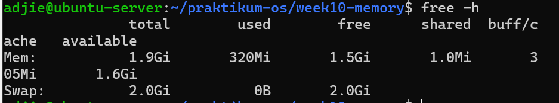
2.  Lihat detail memori dari kernel melalui /proc/meminfo.
```
cat / proc / meminfo | head -n 20
```
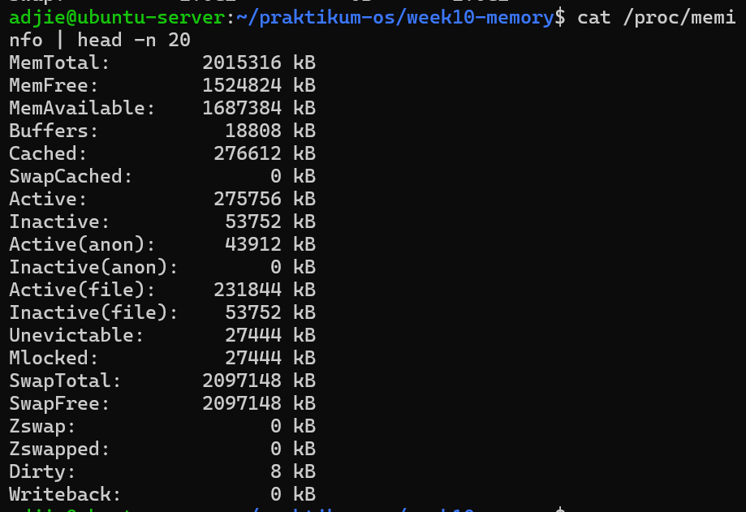

### Studi Kasus 10.1 Server Lambat karena Memori
Langkah 1: Periksa kondisi memori secara keseluruhan.
```
free -h
```
Langkah 2: Pantau proses secara real-time.
```
top
```
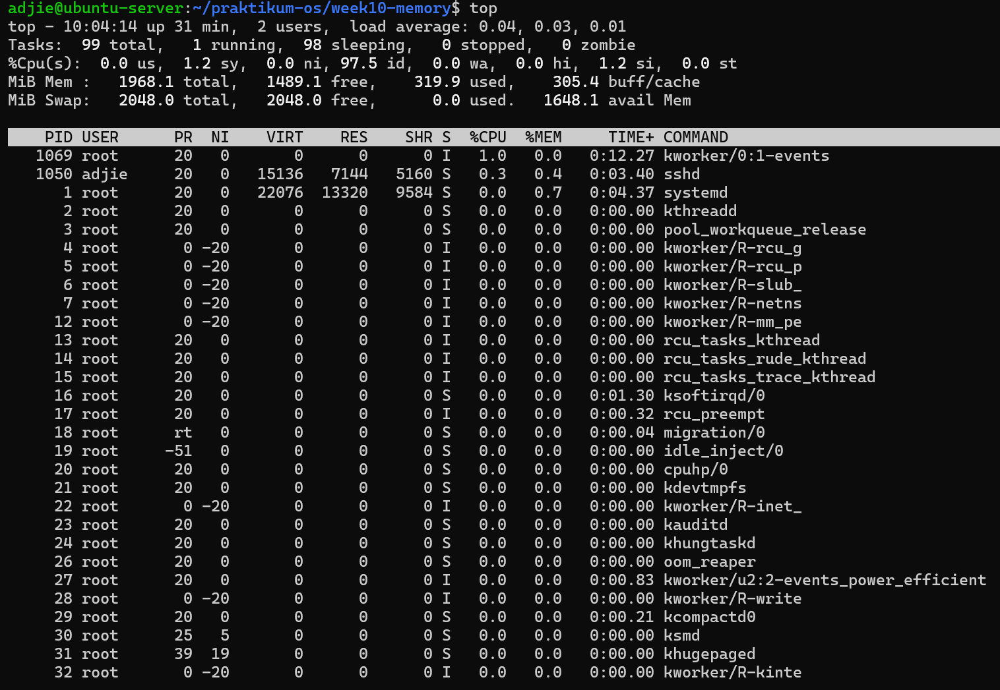

Di dalam top: tekan M untuk mengurutkan berdasarkan memori, tekan q
untuk keluar.
### Analisis:
1. Apakah nilai available sangat kecil (misalnya di bawah 200 MB pada server
dengan RAM 2 GB)? Jika ya, server kemungkinan kekurangan memori.
2. Apakah kolom used pada baris Swap lebih dari 0? Jika ya, kernel sedang
menggunakan swap, yang berarti performa menurun.
3. Di tampilan top, proses apa yang memiliki %MEM terbesar? Proses tersebut
menjadi kandidat utama penyebab lambatnya server.
Jawaban : 
- Indikator Utama: Nilai available pada free -h adalah angka yang paling menentukan kesehatan server karena mencakup RAM yang benar-benar siap dipakai aplikasi baru.  

- Cache & Buffer: Linux sengaja menggunakan RAM kosong untuk cache guna mempercepat I/O. Ini bukan pemborosan, melainkan efisiensi karena kernel akan melepasnya otomatis jika aplikasi butuh ruang.

## Praktikum 10.2 Mengamati Aktivitas Paging
1. Langkah 1: Jalankan vmstat dengan interval 1 detik, 5 sampel.
```
vmstat 1 5
```
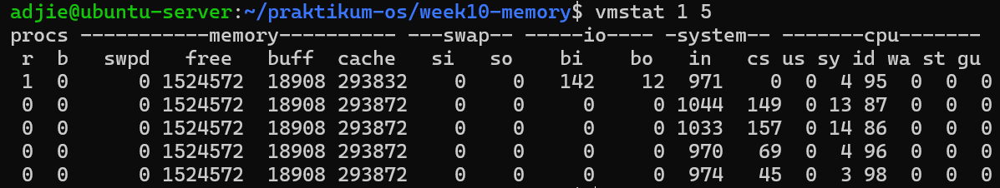
### Analisis:
1. Amati nilai si dan so pada kelima baris. Pada sistem normal dengan RAM
cukup, kedua nilai ini selalu 0.
1 Manajemen Memori & System Call 5
1.3 Konfigurasi Swap Space
2. Jika nilai si atau so sesekali muncul lebih dari 0, artinya pernah ada aktivitas
swap. Ini masih wajar jika tidak terus-menerus.
3. Jika si dan so terus-menerus lebih dari 0, sistem dalam kondisi memory
pressure serius — performa turun drastis karena akses disk jauh lebih lambat
dari RAM.
4. Perhatikan juga kolom free (RAM kosong) dan buff (buffer) untuk memahami
kondisi keseluruhan RAM saat itu.
Jawaban : 
- Swap In (si) & Swap Out (so): Pada kondisi ideal, nilai ini harus 0. Jika si dan so terus-menerus di atas 0, sistem sedang mengalami memory pressure yang mengakibatkan performa turun drastis karena akses disk jauh lebih lambat dari RAM.

## Praktikum 10.3 Membuat dan Mengonfigurasi Swap File
1. Langkah 1: Buat file berukuran 512 MB sebagai calon swap.
```
sudo fallocate -l 512 M / swapfile - week10
```
Kode 1.13: Membuat script grading-batch.sh
2. Langkah 2: Atur permission file menjadi 600 — hanya root yang boleh membaca dan menulis.
```
sudo chmod 600 / swapfile - week10
```
3. Langkah 3: Format file sebagai area swap, lalu aktifkan.
```
sudo mkswap / swapfile - week10
sudo swapon / swapfile - week10
```
Kode 1.15: Menjalankan script grading
4. Langkah 4: Verifikasi swap aktif. Anda akan melihat entri /swapfile-week10
dengan ukuran 512M, dan nilai total pada baris Swap di free -h bertambah 512M
```
swapon -- show
free -h
```
Kode 1.16: Membuat script menu-sistem.sh
5. Langkah 5: Periksa nilai swappiness, ubah sementara, dan verifikasi perubahan.
```
cat / proc / sys / vm / swappiness
sudo sysctl vm . swappiness =10
cat / proc / sys / vm / swappiness
```


### Analisis
1. Berapa nilai swappiness default? Apa artinya bagi perilaku kernel dalam
menggunakan swap?
2. Setelah diubah ke 10, konfirmasi nilai berubah pada output cat kedua. Apa
dampak nilai 10 terhadap penggunaan swap dibanding nilai 60?
3. Apakah entri /swapfile-week10 muncul di swapon –show? Jika tidak,
pastikan Langkah 2 (chmod 600) sudah dijalankan sebelum Langkah 3.
Jawaban : 
- Swappiness: Mengubah nilai ke 10 membuat kernel lebih defensif; ia hanya akan memindahkan data ke disk jika RAM benar-benar mendesak. Ini sangat disarankan untuk menjaga responsivitas server aplikasi.  
- Keamanan: Penggunaan chmod 600 pada file swap adalah wajib karena file tersebut menyimpan potongan data sensitif langsung dari memori proses. 

## Praktikum 10.4 Monitoring Memory
1. Langkah 1: Ambil snapshot proses diurutkan dari penggunaan memori terbesar.
```
ps aux -- sort = -% mem | head
```
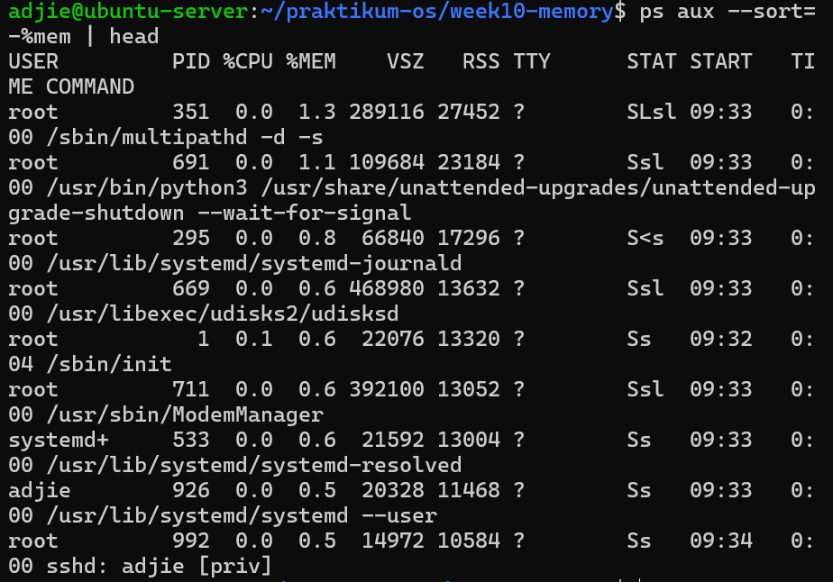
2. Langkah 2: Pantau secara real-time dengan top.
```
top
```
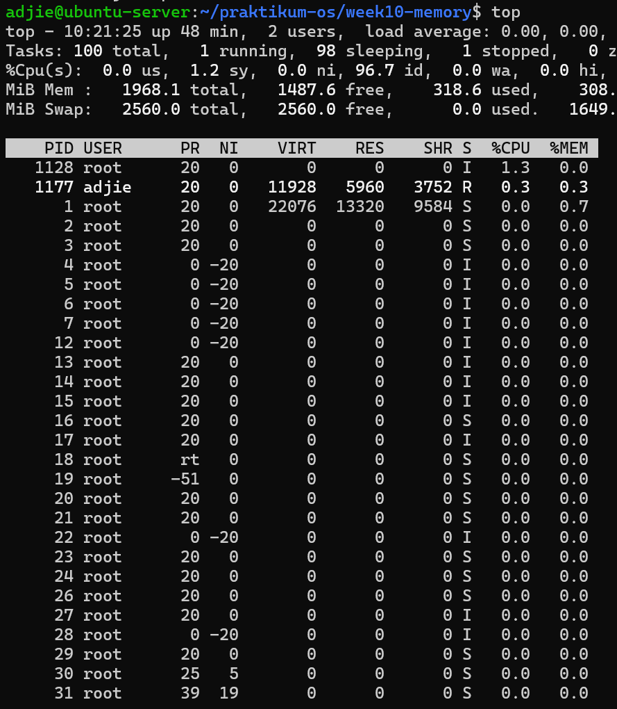
### Analisis
1. Proses apa yang berada di urutan pertama? Catat nilai %MEM dan RSS-nya.
2. Konversikan RSS dari KB ke MB (bagi 1024). Misalnya, RSS=524288 berarti proses menggunakan 512 MB RAM. Apakah wajar untuk jenis program
tersebut?
3. Mengapa VSZ selalu lebih besar dari RSS pada proses yang sama?
4. Apakah urutan proses di ps konsisten dengan tampilan top saat diurutkan
berdasarkan %MEM?
Jawaban : 
- VSZ vs RSS: VSZ (Virtual Memory) selalu lebih besar karena mencakup seluruh ruang alamat yang dialokasikan (termasuk library bersama), sedangkan RSS hanya menunjukkan porsi yang benar-benar duduk di RAM fisik saat itu.  

- Otomasi: Script monitor mempermudah administrator mendeteksi masalah secara proaktif tanpa harus mengetik perintah manual berulang kali.

## Praktikum 10.5 Script Monitor Memori
1. 1 Manajemen Memori & System Call
```
cd ~/ praktikum - os / week10 - memory
nano monitor - memori . sh

#!/ bin / bash
set - euo pipefail
THRESHOLD =20
echo "=== Monitor Memori ==="
date
echo
free -h
echo
AVAIL = $ ( free | awk '/ Mem / { printf "% d " , $7 / $2 *100} ')
if [ " $AVAIL " - lt " $THRESHOLD " ]; then
echo " PERINGATAN : Memori tersedia hanya $ { AVAIL }%!"
else
echo " Status : Memori tersedia $ { AVAIL }% ( normal ) "
fi
echo
echo " - - - 5 Proses Memori Tertinggi - - -"
ps aux -- sort = -% mem | head -n 6 | tail -n 5
```


### analisis
1. Variabel THRESHOLD=20 menetapkan batas persentase. Perintah free | awk
’/Mem/ {printf "%d", $7/$2*100}’ mengambil kolom ke-7 (available) dibagi
kolom ke-2 (total) dari baris Mem, lalu dikalikan 100 untuk menghasilkan
persentase bilangan bulat.
2. Kondisi if [ "$AVAIL" -lt "$THRESHOLD" ] bernilai benar jika persentase
memori tersedia di bawah 20.
3. Ubah THRESHOLD menjadi 90 dan jalankan ulang. Apa yang berubah pada
output? Mengapa demikian?
Jawaban : 
- Interaksi Kernel: Setiap error seperti Permission denied pada perintah cat atau ls sebenarnya berasal dari kegagalan fungsi di level kernel (seperti openat) yang ditangkap oleh strace.  

- Diagnosa dengan strace: Program seringkali menghasilkan errors pada strace (seperti file not found) yang merupakan bagian normal dari logika pencarian konfigurasi program tersebut.

## Studi Kasus 10.2 Gagal Akses File
1. Langkah 1: Buat direktori dan file konfigurasi contoh.
```
mkdir -p ~/ praktikum - os / week10 - memory / syscall - case
cd ~/ praktikum - os / week10 - memory / syscall - case
echo " PORT =8080" > app . conf
ls -l app . conf
cat app . conf
```

2. Langkah 2: Simulasikan permission bermasalah
```
chmod 000 app . conf
cat app . conf
```

3. Langkah 3: Kembalikan permission dan verifikasi.
```
chmod 644 app . conf
cat app . conf
```


### Praktikum 10.6 Mengamati System Call dengan strace
1. Langkah 1: Lihat 30 baris pertama system call dari perintah ls.
```
strace ls 2 >&1 | head -n 30
```
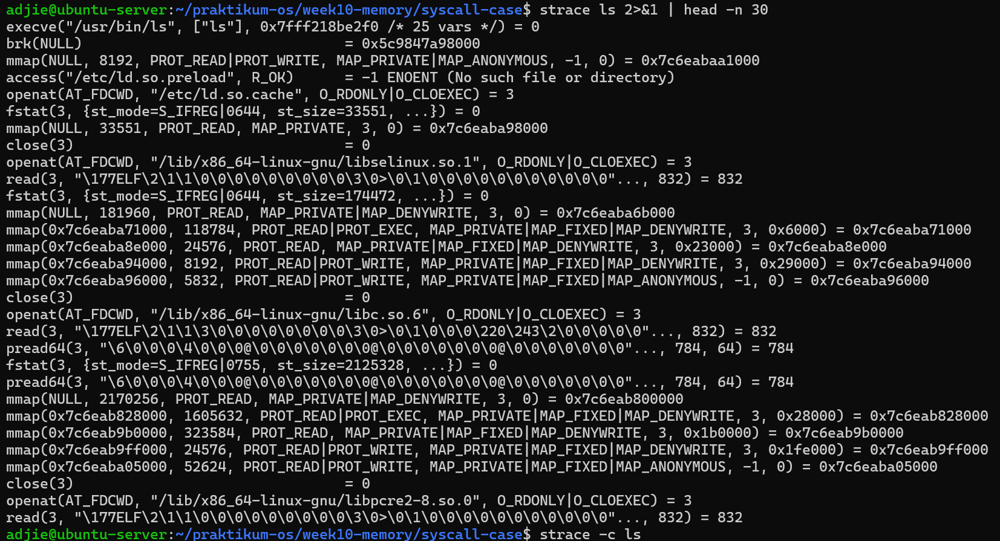
2. Langkah 2: Lihat ringkasan statistik dan bandingkan dua direktori berbeda.
```
strace -c ls
strace -c ls / etc 2 >&1 | tail -5
```
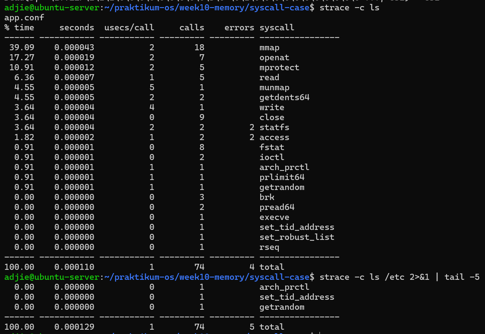
### Analisis
1. Dari output Langkah 1, identifikasi minimal 4 system call berbeda. Jelaskan
fungsi singkat masing-masing berdasarkan argumen yang terlihat.
2. Dari ringkasan strace -c, system call mana yang paling sering dipanggil?
Mengapa?
3. Apakah ada system call dengan errors lebih dari 0? Apakah itu berarti
program bermasalah, ataukah bagian normal dari logika program?
4. Apakah jumlah system call berbeda antara ls dan ls /etc? Faktor apa yang
menyebabkan perbedaan tersebut?
Jawaban : 
- Interaksi User Space & Kernel Space: strace membuktikan bahwa perintah sederhana seperti ls tidak bekerja sendirian, melainkan harus melakukan puluhan hingga ratusan "permintaan" ke kernel melalui system call untuk mengakses hardware atau filesystem.

## 1.6 Tugas Praktikum
### Tugas 10.1 Audit Penggunaan Memori Sistem
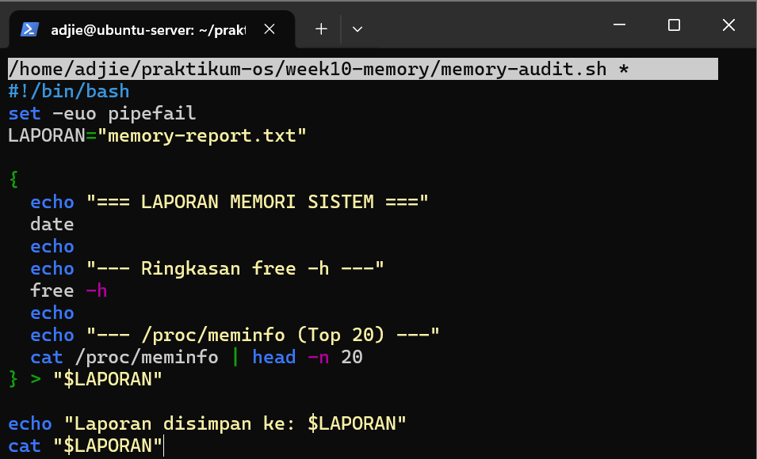
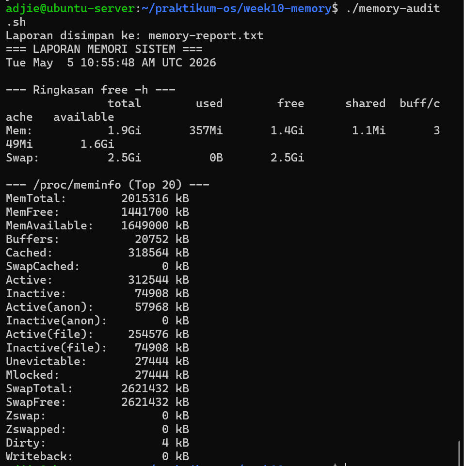
### Tugas 10.2 Identifikasi Proses dengan Memori Tertinggi
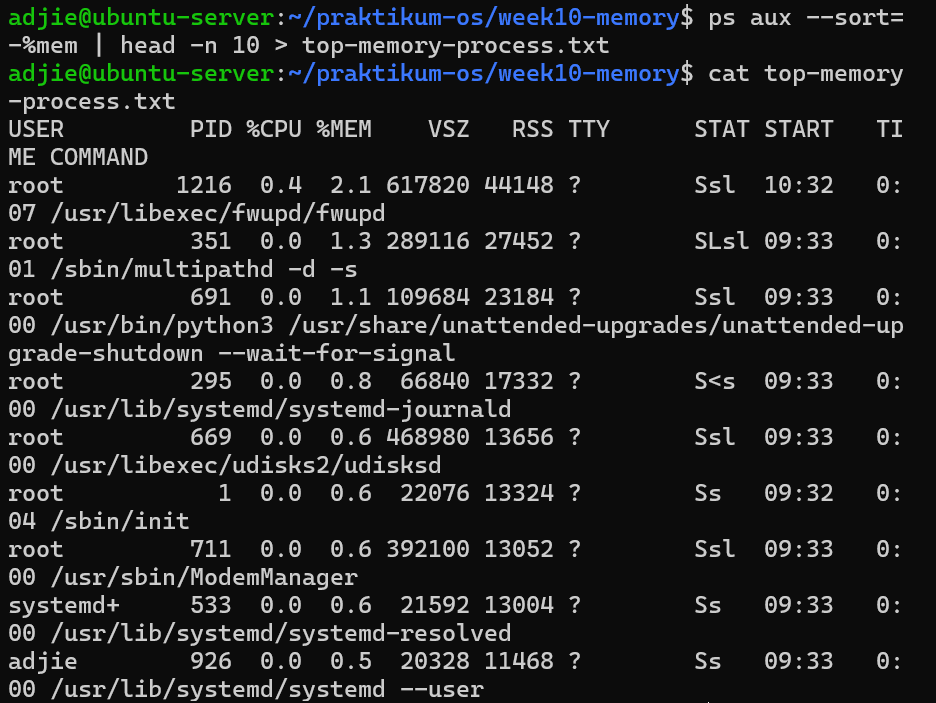
### Tugas Tugas 10.3 Membuat dan Memverifikasi Swap File
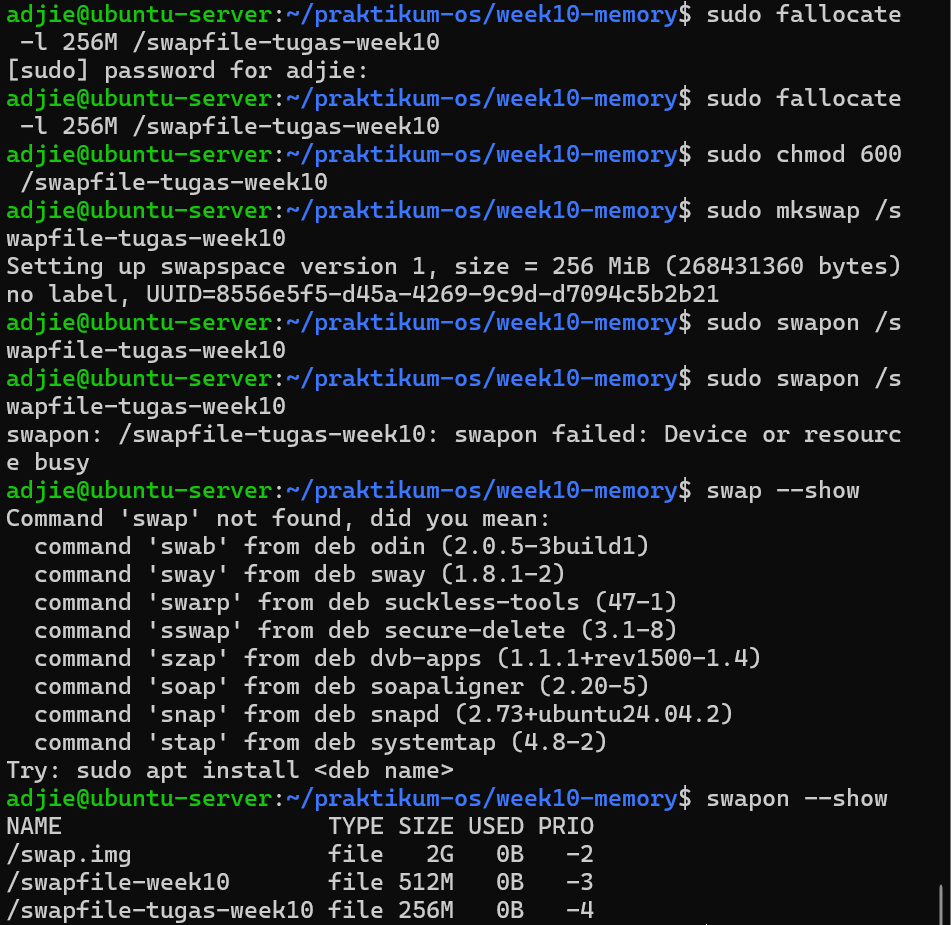
### Tugas 10.4 Analisis System Call dengan strace
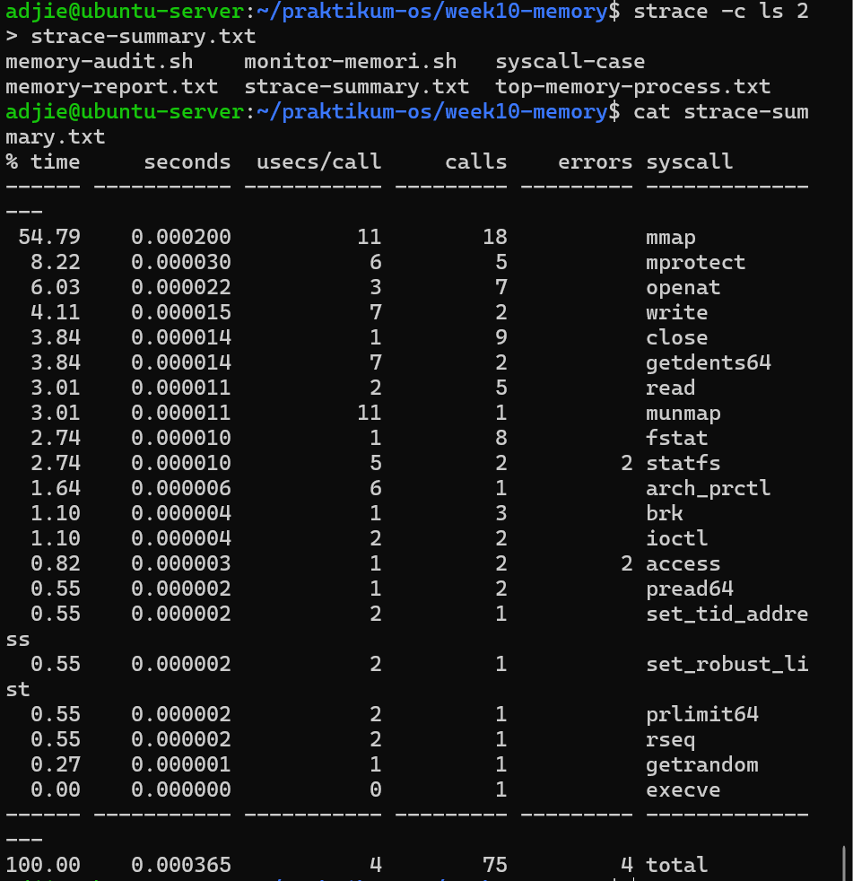
### Tugas  10.5 Studi Kasus Diagnosa Server Lambat
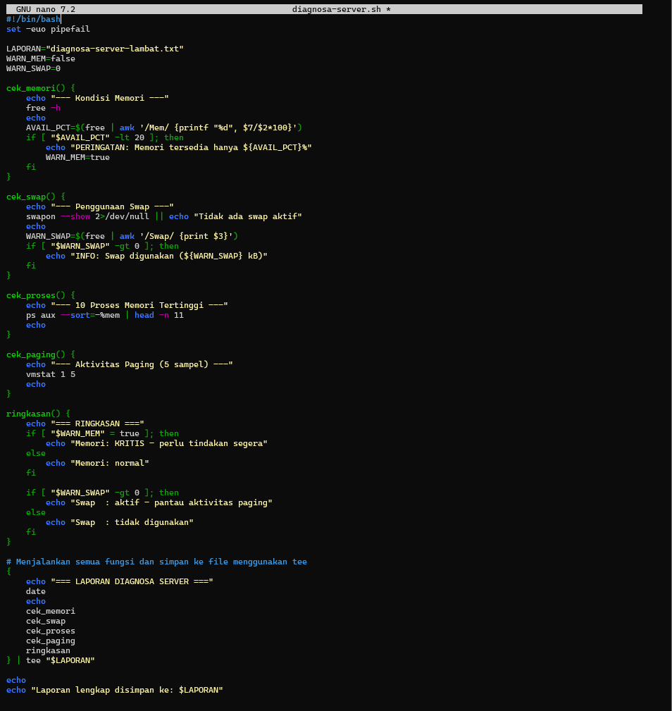
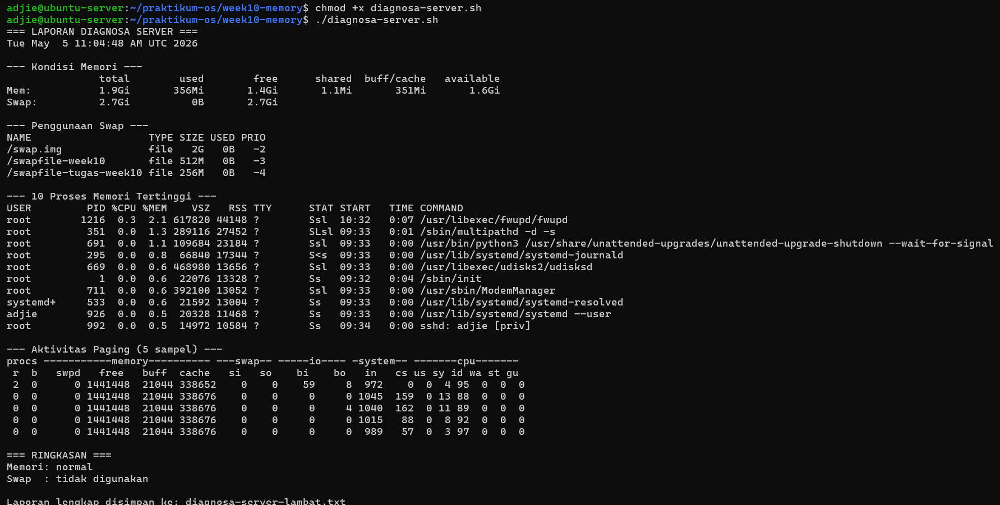