# Laporan Praktikum Sistem Operasi Jobsheet 2

<h4> Nama   : Muhammad Unggul Satria Adjie <h4>
<h4> NIM    : 254107020040 <h4>
<h4> Kelas  : TI-1G <h4>

## Praktikum 2.1 - Identifikasi CPU dan Memory
1. Tampilkan Informasi CPU:
```    
lscpu
```
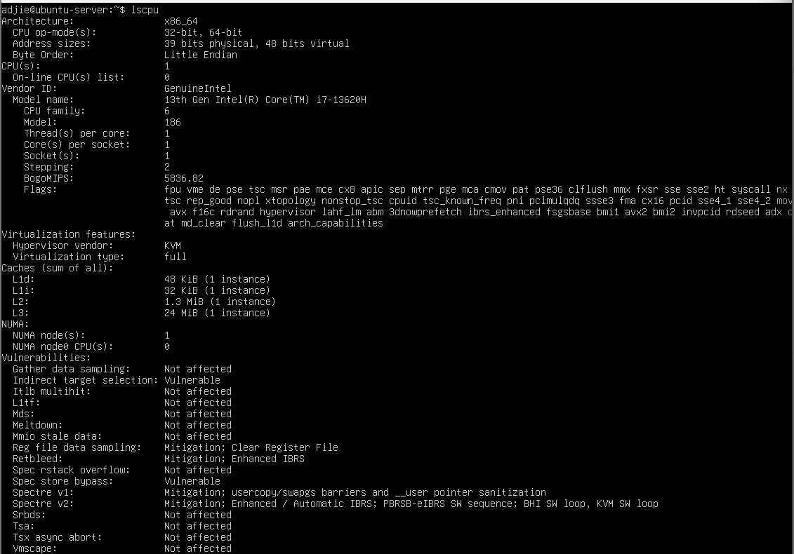

2. Tampilkan Ringkasan Memory
```
free -h
```


3. (Opsional) cek informasi hardware dari DMI/BIOS (butuh sudo):
```
sudo dmidecode -t system
```


### Latihan 2.1
Catat: (1) jumlah CPU(s), core/thread, (2) total RAM, (3) total swap. Jelaskan perbedaan RAM vs swap dalam 2–3 kalimat.

Jawab :<br>
* Informasi CPU
Jumlah CPU (Logical cores): 8
Core per socket: 4 Core fisik.
Thread per core: 2 (Artinya setiap core fisik bisa mengerjakan 2 tugas sekaligus).

* Informasi Memori
Total RAM: 3.7 GiB (Sekitar 4 GB).
Total Swap: 1.0 GiB.

* Apa bedanya RAM vs Swap?
RAM adalah memori utama yang sangat cepat untuk memproses data aplikasi yang sedang kamu buka. Sementara itu, Swap berfungsi sebagai area perluasan di dalam hard disk atau SSD yang digunakan sistem hanya saat RAM fisik sudah hampir penuh, guna mencegah komputer hang atau aplikasi tertutup tiba-tiba.

## Praktikum 2.2 - Identifikasi Perangkat PCI/USB dan Driver
1. Lihat daftar perangkat PCI:
```
lspci
```
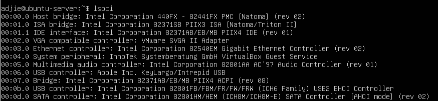

2. Lihat perangkat PCI beserta driver kernel yang digunakan:
```
lspci - nnk
```


3. Fokus pada NIC (Ethernet) untuk mencari modul driver:
```
lspci - nnk | grep - A3 -i ethernet
```
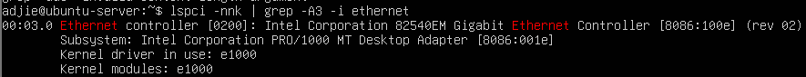

4. Lihat perangkat USB:
```
lsusb
```
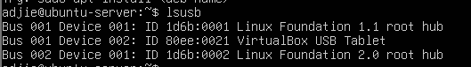

5. Lihat topologi USB (tree):
```
lsusb -t
```
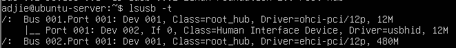

### Latihan 2.2
Temukan 1 perangkat PCI (misal NIC) dan tuliskan: Vendor:Device ID (angka
heksadesimal), nama driver/modul kernel, dan deskripsi singkat fungsinya.

Jawab   :
* Vendor:Device ID: 1414:008e
(Penjelasan: Angka heksadesimal ini ditemukan di dalam kurung kotak di baris pertama perangkat tersebut).
* Nama Driver/Modul Kernel: dxgkrnl
(Penjelasan: Terlihat pada baris "Kernel driver in use").
* Deskripsi Singkat Fungsinya:  Perangkat ini berfungsi sebagai pengontrol grafis 3D virtual yang memungkinkan sistem Linux kamu (WSL) menggunakan tenaga kartu grafis (GPU) dari Windows untuk menjalankan aplikasi yang butuh performa visual tinggi atau perhitungan berat.

## Praktikum 2.3 — Identifikasi Storage dan Filesystem
1. Lihat daftar disk/partisi:
```
lsblk -f
```
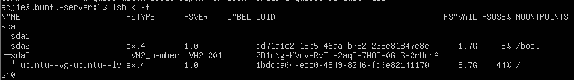

2. Tampilkan UUID dan tipe filesystem:
```
sudo blkid
```
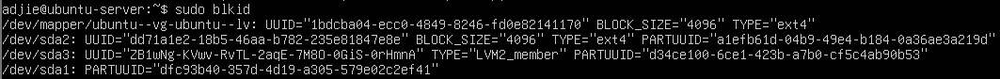

3. Lihat mount point untuk root filesystem:
```
findmnt /
```
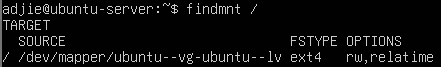

## Praktikum 2.4 — Melihat Modul Aktif dan Informasinya
1. Cek versi kernel:
```
uname -r
```
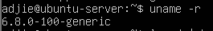

2. Tampilkan daftar modul aktif:
```
lsmod | head
```
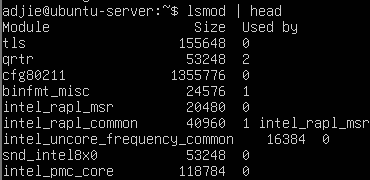

3. Pilih salah satu modul (contoh aman: loop) dan lihat detailnya:
```
modinfo loop
```
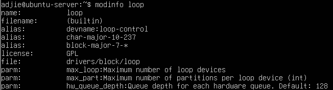

4. Muat modul (jika belum aktif), lalu verifikasi:
```
1 sudo modprobe loop
2 lsmod | grep -i loop
```
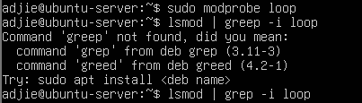

5. (Opsional) lihat pesan kernel terbaru:
```
dmesg -T | tail -n 20
```


## Praktikum 2.5 — Konfigurasi Auto-load dan Blacklist
1. Buat file auto-load:
```
echo " loop " | sudo tee / etc / modules - load . d / loop . conf
```


2. Simulasikan verifikasi (tanpa reboot) dengan memastikan modul sudah aktif:
```
lsmod | grep -i loop
```


3. (Opsional, konsep) blacklist modul:
```
1 # echo " blacklist loop " | sudo tee / etc/ modprobe .d/blacklist - loop . conf
```


## Praktikum 2.6 — Mengenali Block vs Character Device
1 Manajemen Perangkat Keras & Perintah Dasar Sistem Operasi
```
 ls -l / dev / sda
 ```
 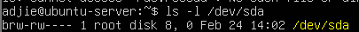

 2. Lihat detail device terminal:
```
ls -l / dev / tty
```
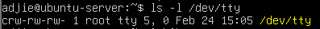

3. Lihat disk dan partisi untuk mengaitkan dengan /dev:
```
lsblk
```
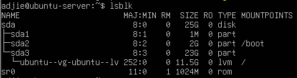

### Latihan 2.3
Dari output ls -l, jelaskan perbedaan penanda file untuk block device dan character device. (Hint: karakter pertama pada permission string)

Jawab:
* Block Device (Penanda 'b'): Terlihat pada Gambar percobaan pertama untuk perangkat /dev/sda, di mana karakter paling awal dari string permission adalah huruf b. Ini menunjukkan perangkat yang mengelola data dalam bentuk blok besar, seperti harddisk atau SSD.

* Character Device (Penanda 'c'): Terlihat pada Gambar percobaann kedua untuk perangkat /dev/tty, di mana karakter paling awal dari string permission adalah huruf c. Ini menunjukkan perangkat yang mengelola data karakter per karakter secara berurutan, seperti terminal atau keyboard.

## Praktikum 2.7 — Melihat Informasi udev
1. Cek atribut udev untuk disk:
```
1 udevadm info -- query = all -- name =/ dev / sda | head -n 30
```
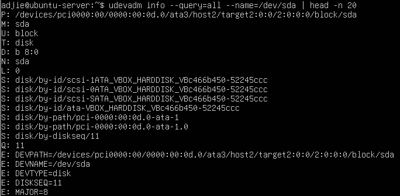

2. (Opsional) monitor event udev (jalankan, lalu colok/lepas USB pada mesin fisik):
```
1 sudo udevadm monitor
```
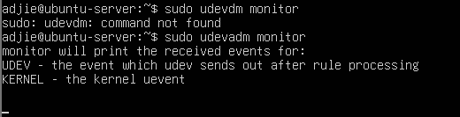

## Praktikum 2.8 — Membuat Workspace Praktikum
1. Buat direktori praktikum dan masuk ke dalamnya:
```
1 mkdir -p ~/ praktikum - os / week02
2 cd ~/ praktikum - os / week02
3 pwd
```
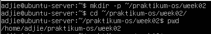

2. Buat beberapa file contoh:
```
1 touch notes . txt data . log config . txt
2 ls - lah
```
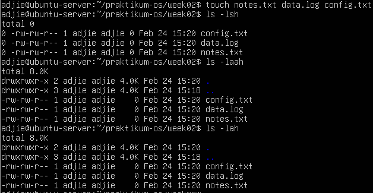

3. Isi file log contoh (simulasi):
```
1 echo " INFO : service started " >> data . log
2 echo " WARN : disk usage high " >> data . log
3 echo " ERROR : failed to connect " >> data . log
4 cat data . log
```
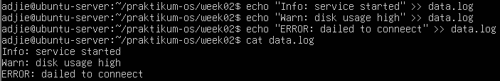

4. Baca file dengan less:
```
1 less data . log
```
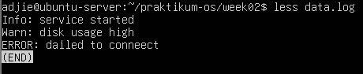

## Praktikum 2.9 — Pencarian Pola dengan grep

1. Cari baris yang mengandung ERROR pada data.log:
```
1 grep " ERROR " data . log
```
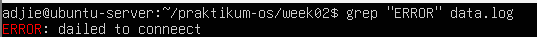

2. Cari tanpa memperhatikan huruf besar/kecil:
```
1 grep -i " error " data . log
```
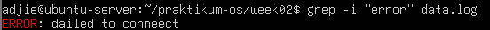

3. Tampilkan nomor baris:
```
1 grep -n " WARN " data . log
```
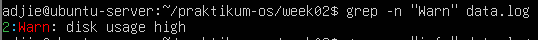

4. Tampilkan baris yang tidak cocok (invert match):
```
1 grep -v " INFO " data . log
```
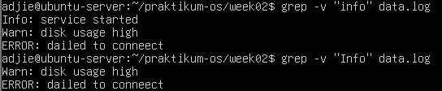

### Latihan 2.4
Gunakan grep untuk menampilkan hanya baris yang mengandung INFO atau WARN dari data.log. (Hint: gunakan grep -E dengan pola alternatif)

Jawab:  
```
grep -E "INFO|WARN" data.log
```
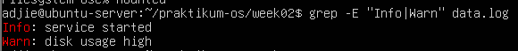

## Praktikum 2.10 — Substitusi dengan sed (Aman di File Latihan)
1. Siapkan file konfigurasi latihan:
```
1 cat > config . txt << ’EOF ’
2 PORT =8080
3 MODE = dev
4 SERVICE_NAME = myserver
5 EOF
6 cat config . txt
```
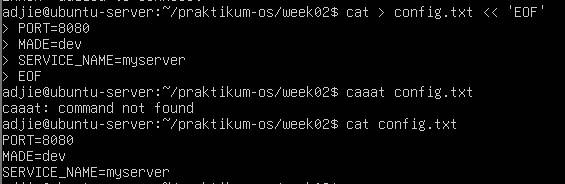

2. Ganti dev menjadi prod (tanpa mengubah file asli):
```
1 sed ’s/ MODE =dev/ MODE = prod /’ config . txt
```
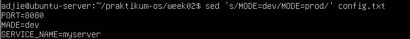

3. Terapkan perubahan langsung ke file (-i):
```
1 sed -i ’s/ MODE =dev/ MODE = prod /’ config . txt
2 cat config . txt
```
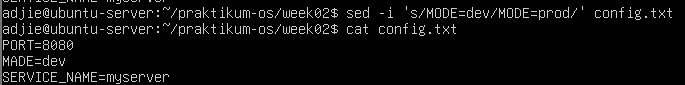

4. Ganti semua kemunculan kata (g untuk global), contoh ubah myserver menjadi node:
```
1 sed -i ’s/ myserver / node /g’ config . txt
2 cat config . txt
```
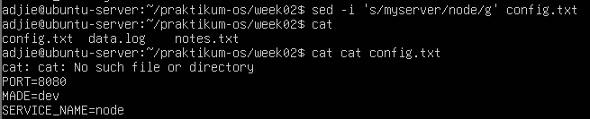

## Praktikum 2.11 — Ekstraksi Kolom dengan awk
1. Lihat output df -h:
```
1 df -h
```
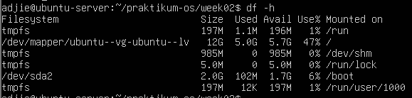

2. Ambil kolom filesystem dan persentase pemakaian:
```
1 df -h | awk ’NR ==1 { print $1 , $5 , $6} NR >1 { print $1 ,$5 , $6}’
```
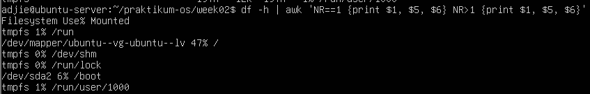

3. Filter hanya yang pemakaian disk di atas 80%:
```
1 df -h | awk ’NR ==1 || ($5 +0) > 80 { print $1 , $5 , $6}’
```
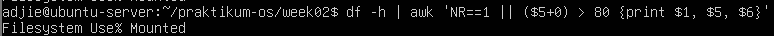

## Praktikum 2.12 — Melihat Proses dengan ps
1. Tampilkan semua proses (format BSD):
```
1 ps aux | head
```
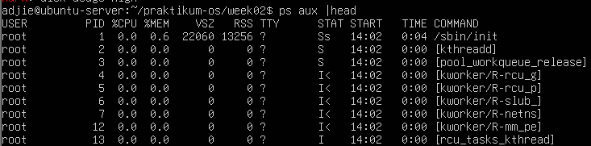

2. Cari proses tertentu (misal sshd):
```
1 ps aux | grep -i sshd
```
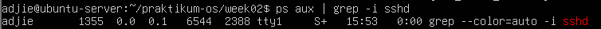

## Praktikum 2.13 — Monitoring Real-time dengan top
1. Jalankan top:
```
1 top
```
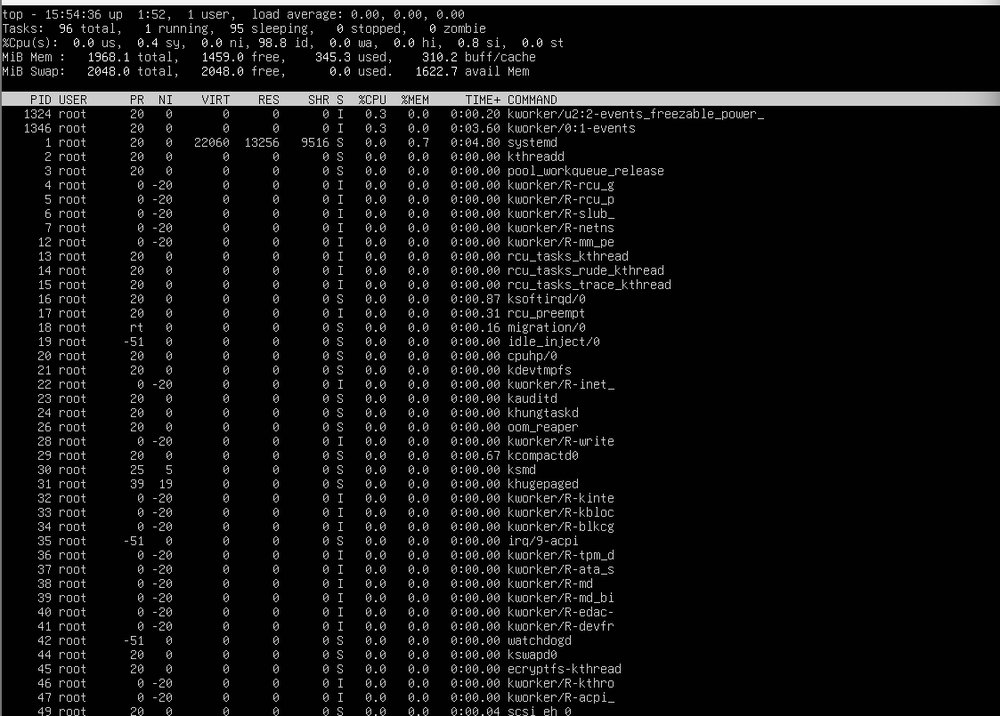

2. Amati nilai load average, pemakaian CPU, dan proses teratas. Tekan q untuk
keluar.
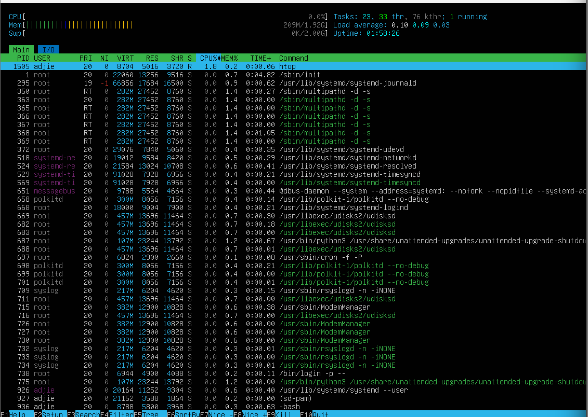

## Praktikum 2.14 — Menghentikan Proses dengan kill
1. Jalankan proses dummy di background:
```
1 sleep 300 &
```


2. Cari PID proses sleep:
```
1 ps aux | grep -E " sleep 300 " | grep -v grep
```


3. Hentikan dengan SIGTERM:
```
1 kill < PID_ANDA >
```


4. Verifikasi proses berhenti:
```
1 ps aux | grep -E " sleep 300 " | grep -v grep
```


5. (Opsional) Jika proses sulit untuk dihentikan dan Anda membutukan untuk menghentikan proses tersebut, gunakan SIGKILL:
```
1 kill -9 < PID_ANDA >
```

## Praktikum 2.15 — Cek Disk, Load, dan Service
1. Cek penggunaan disk:
```
1 df -h
```


2. Cari direktori yang besar (contoh pada /var):
```
1 sudo du - sh / var /* 2 >/ dev / null | sort -h | tail -n 10
```


3. Cek load dan uptime:
```
1 uptime
```


4. Cek service yang gagal:
```
1 systemctl -- failed
```


5. Ambil log error terbaru (jika ada indikasi masalah):
```
1 journalctl - xe | tail -n 50
```


## Praktikum 2.16 — Monitoring Port dan Koneksi (Network Basics)
1. Lihat interface dan IP:
```
1 ip a
```


2. Lihat routing table:
```
1 ip r
```


3. Lihat port yang sedang listening:
```
1 sudo ss - tulpn
```


### Latihan 2.5
Pilih satu port yang listening dari output ss -tulpn(misal port 22), lalu tuliskan service/proses yang membukanya. Jelaskan kegunaan port tersebut secara singkat.

Jawab: 
* Port yang Dipilih: Port 53 (Layanan DNS).

* Service/Proses: Dibuka oleh proses systemd-resolve (dengan Process ID atau PID 92).

* Analisis Protokol: Port ini berjalan pada protokol TCP dan UDP secara bersamaan untuk memastikan pengiriman data yang efisien dan reliabel.

* Kegunaan: Port 53 berfungsi sebagai layanan DNS (Domain Name System) yang bertugas sebagai "penerjemah" alamat; ia mengubah nama domain yang mudah diingat manusia (seperti https://www.google.com/search?q=google.com) menjadi alamat IP numerik yang dipahami oleh mesin agar koneksi internet dapat terhubung ke tujuan yang benar.

## 1.9 Latihan
### Latihan 2.A
Jalankan lspci -nnk. Pilih 1 perangkat PCI dan tuliskan: nama perangkat, ID vendor:device, dan kernel driver in use.
* Pilihan Perangkat: SCSI storage controller
* Nama Perangkat: Red Hat, Inc. Virtio console
* ID vendor:device: 1af4:1043
* Kernel driver in use: virtio-pci


### Latihan 2.B
Tentukan device root filesystem dengan findmnt /. Lalu cocokkan dengan lsblk -f dan tuliskan tipe filesystem serta UUID-nya.
* Device Root: /dev/sdd
* Tipe Filesystem: ext4
* UUID: 4f690b8a-b7b4-4fff-a844-9d78953e7f90


### Latihan 2.C
Buat file server.log berisi minimal 10 baris dengan variasi kata: INFO, WARN, ERROR. Gunakan grep untuk menampilkan hanya baris ERROR.


### Latihan 2.D
Gunakan sed untuk mengganti semua kata server menjadi node pada file latihan. Tunjukkan sebelum dan sesudah.
* Before  :


* After   :


### Latihan 2.E
Gunakan df -h lalu awk untuk menampilkan filesystem yang penggunaan disk di atas 70%.

* Saat perintah dijalankan, tidak ada output yang muncul. Hal ini menunjukkan bahwa seluruh filesystem pada sistem saat ini memiliki penggunaan disk di bawah 70% (kondisi sistem sehat).

### Latihan 2.F
Jalankan sleep 600 &. Temukan PID-nya dengan ps. Hentikan dengan SIGTERM. Jelaskan beda SIGTERM vs SIGKILL.
* SIGTERM (15): Adalah sinyal penghentian standar. Ini seperti menekan tombol "Close" atau "Exit" pada aplikasi. Proses diberi kesempatan untuk menyimpan data dan menutup diri dengan rapi.

* SIGKILL (9): Adalah penghentian paksa. Ini seperti mencabut kabel power komputer. Proses langsung mati seketika tanpa sempat menyimpan apa pun.


### Latihan 2.G
Gunakan systemctl –failed. Jika tidak ada yang gagal, pilih satu service aktif (misal ssh) dan tampilkan status serta 30 baris log terakhirnya.
