# Laporan Praktikum Sistem Operasi Jobsheet 6

<h4> Nama   : Muhammad Unggul Satria Adjie <h4>
<h4> NIM    : 254107020040 <h4>
<h4> Kelas  : TI-1G <h4>

## Praktikum 6.1 — Melihat Proses dan Thread
1. Tampilkan semua proses yang berjalan
```
ps aux
```
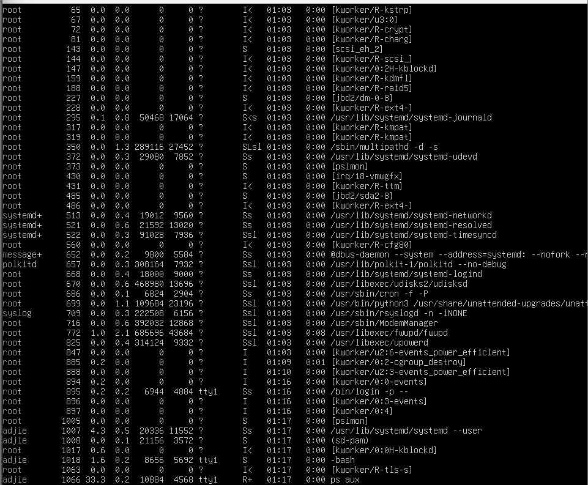
2. Tampilkan proses beserta thread-nya, dapat dilihat pada kolom LWP (LightWeight Process ID)
```
ps aux-L
```
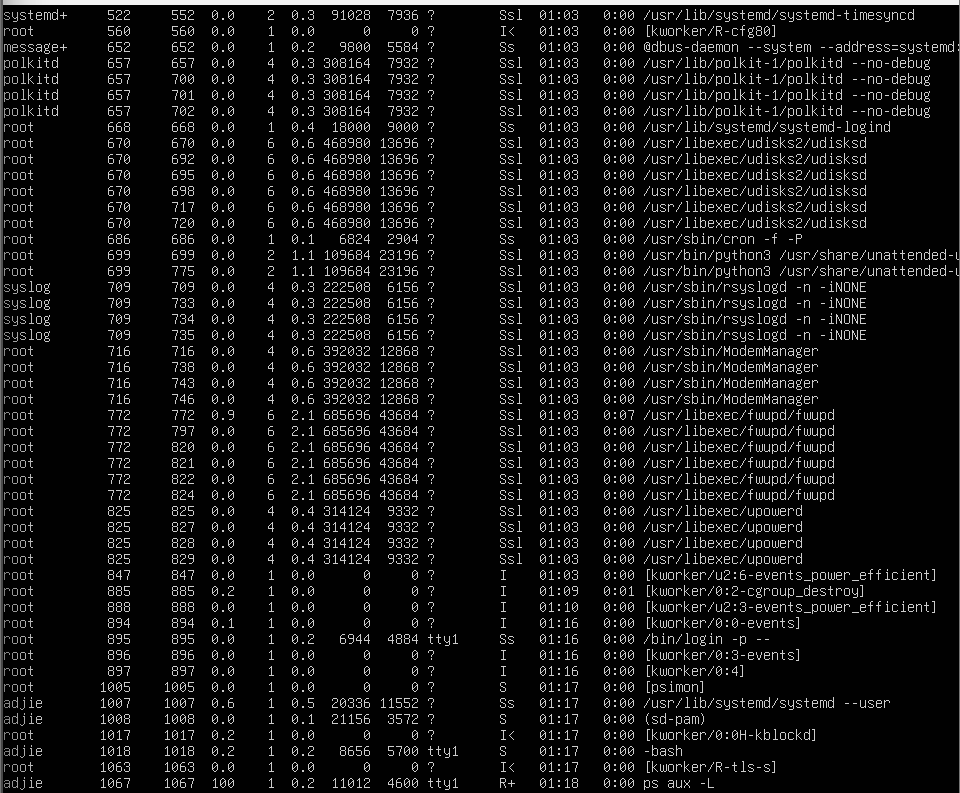
3. Lihat PID shell aktif dan detail prosesnya
```
echo $$
ps -p $$ -f
```
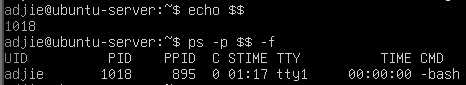
4. Lihat hierarki proses secara visual
```
pstree -p
```
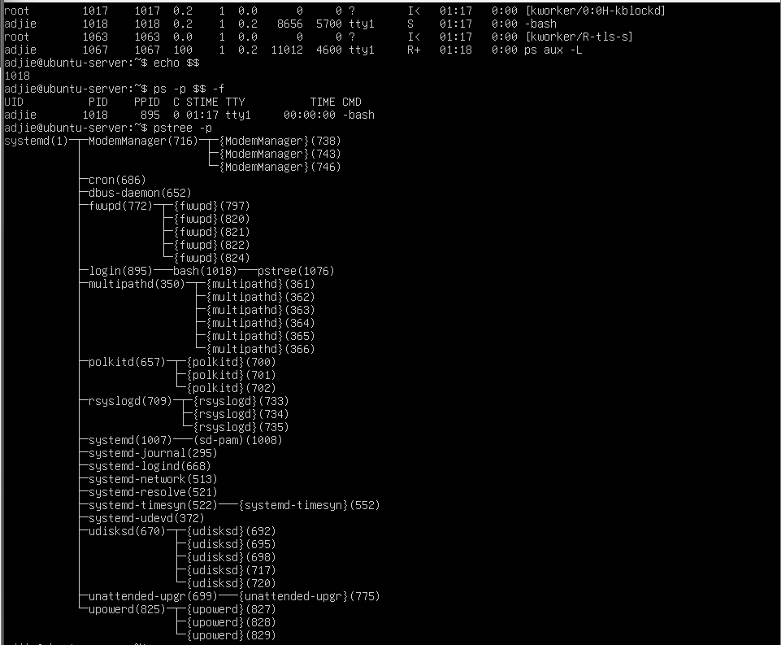

# Latihan 6.1
1. Berapa total proses yang berjalan? Proses apa yang memiliki PID
terkecil?
Jawaban : 
Proses yang memiliki PID terkecil adalah proses systemd dengan PID 1.
Hal ini terlihat jelas pada hierarki output pstree -p.

2. Jalankan pstree -p dan temukan proses bash Anda. Proses apa yang
menjadi induk (PPID) dari bash tersebut?
Jawaban : 
proses bash saya memiliki PID 1018. Proses yang terhubung langsung di sebelah kirinya
dan PPID yang menjadi induk dari bash tersebut adalah proses login dengan PID 895.

3. Bandingkan output ps aux dan ps aux -L. Apa perbedaan yang Anda
lihat?
Jawaban : 
Perintah ps aux menampilkan setiap program sebagai satu proses tunggal.
Sedangkan perintah ps aux -L menampilkan proses secara lebih detail hingga ke tingkat thread-nya.


## Praktikum 6.2 — Mengamati Siklus Hidup Proses
1. Buat proses di background dan amati kondisinya
```
sleep 60 &
ps aux | grep sleep
```
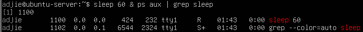
2. Amati perubahan exit code dari perintah yang berhasil dan gagal
```
ls / tmp
echo " Sukses : $?"
ls / direktori - tidak - ada
echo " Gagal : $?"
```
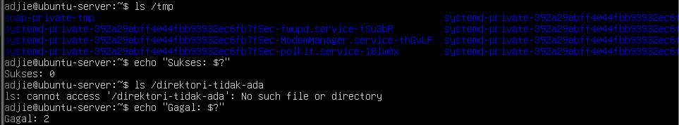

# Latihan 6.2
1. Jalankan sleep 120 & dan amati kolom STAT pada ps aux. Kondisi
apa yang ditampilkan? Mengapa proses sleep berada di kondisi tersebut?
Jawaban :
Kondisi yang ditampilkan pada komol STAT adalah huruf S yang berarti sleep. nah proses sleep ini berapa di sini karena sejdang menunggu kondisi dari surasi 120 detik habis. tetapi selama menunggu proses tidak aktif dieksekusi oleh CPU, namun statusnya masih dapat diinterupsi oleh sinyal
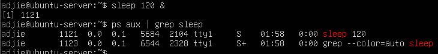
2. Jalankan beberapa perintah yang berhasil dan yang gagal, lalu catat exit
code masing-masing. Pola apa yang Anda temukan?
Jawaban : 
perintah dari ls /tmp menghasilkan ecit code berhasil 0.
Kemudian ls /direktori-tidak-ada menghasilkan exit code yang bernilai selain no yaitu 2

## Praktikum 6.3 — Mengatur Prioritas Proses
1. Menjalankan proses dengan nice +10
```
nice -n 10 sleep 300 &
```
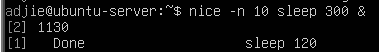
2. Melihat nilai nice
```
ps aux | grep sleep
```
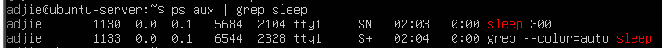
3. Mengubah nice dengan renice
```
renice -n 15 -p <PID >
ps -p <PID > -o pid , ni , cmd
```
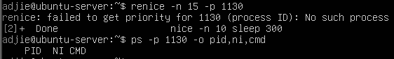
4.  Menghentikan proses percobaan
```
kill %1
```
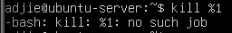

# Latihan 6.3
1. Jalankan nice -n 5 sleep 200 & dan verifikasi nilai NI-nya dengan
ps.
Jawaban : 
perintah yang aku lakukan berhasil membuat proses sleep 200. saat verifikasi menggunakan perintah ps aux | grep sleep dan ps -o pid,ni,cmd | grep sleep, terlihat jelas pada kolom NI bahwa proses tersebut memiliki nilai nice sebesar 5.
2. Ubah nilai nice menjadi 10 menggunakan renice, lalu verifikasi kembali.
Jawaban : 
perintah ini berhasil di lakukan dengan muncul old priority 5, new priority 10. Namun, saat saya mencoba memverifikasinya kembali dengan perintah ps -p 1155 -o pid,ni,cmd, proses tersebut ternyata sudah terhenti secara natural karena durasi waktu sleep 200 detiknya sudah habis (ditandai dengan munculnya keterangan [1]+ Done nice -n 5 sleep 200).
3. Coba ubah nilai nice menjadi -5 tanpa sudo. Apa yang terjadi? Mengapa
Linux membatasi hal ini untuk user biasa?
Jawaban : 
yang terjadi adalah muncul pesan error No such process karena proses sleep 200 (PID 1155) tersebut memang sudah selesai/mati.
tetapi jika linux masih berjalan kondisinya akan memunculkan peringatan Permission denied (Akses Ditolak). Linux membatasi hal ini karena nilai nice negatif (contohnya -5) berfungsi untuk memberikan prioritas yang lebih tinggi kepada proses tersebut.

## Praktikum 6.4 — Mengirim Sinyal ke Proses
1. Membuat proses percobaan
```
sleep 500 &
sleep 600 &
sleep 700 &
ps aux | grep -v grep | grep sleep
```
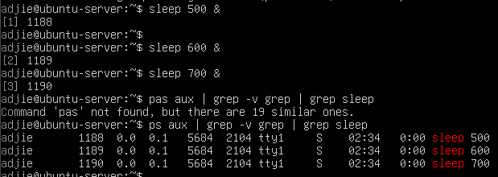
2. Hentikan satu proses dengan SIGTERM dan verifikasi
```
kill <PID - sleep -500 >
ps aux | grep -v grep | grep sleep
```
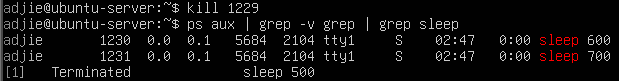
3. Jeda dan lanjutkan proses dengan SIGSTOP/SIGCONT
```
kill - SIGSTOP <PID - sleep -600 >
ps aux | grep sleep # amati kolom STAT : berubah
menjadi T
kill - SIGCONT <PID - sleep -600 >
ps aux | grep sleep # STAT kembali ke S
```
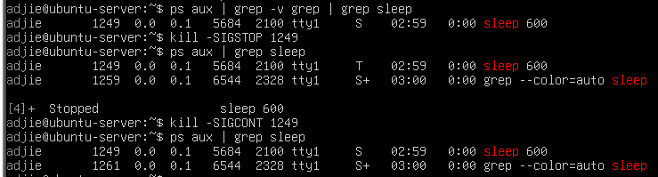
4.  Hentikan semua proses sleep sekaligus
```
pkill sleep
```
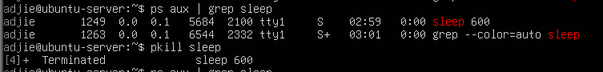

# Latihan 6.4
1. Jalankan sleep 400 &, kirim SIGSTOP, dan amati perubahan kolom STAT. Kondisi apa yang muncul?
Jawaban : 
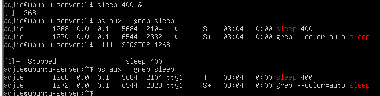
2. Kirim SIGCONT dan verifikasi proses kembali berjalan.
Jawaban : 
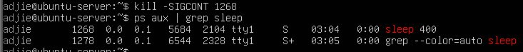
3. Hentikan proses dengan SIGTERM lalu verifikasi sudah tidak ada. Kapan
Anda memilih SIGKILL daripada SIGTERM?
Jawaban : 
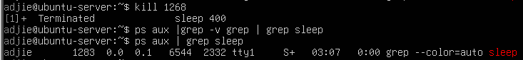

## Praktikum 6.5 — Manajemen Job Foreground dan Background
1. Jalankan tiga job di background
```
sleep 200 &
sleep 300 &
sleep 400 &
jobs
```
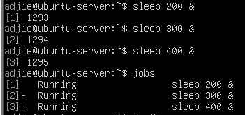
2. job pertama ke foreground, jeda, lalu kembalikan ke backgroundverifikasi
```
fg %1
# Tekan Ctrl +Z untuk menjeda
bg %1
jobs
```
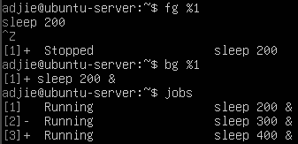
3. Hentikan semua job
```
kill %1 %2 %3
jobs
```
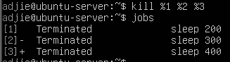

# Latihan 6.5
1. Jalankan top di foreground. Apa yang terjadi di terminal?
Jawaban : 
seharusnya langsung menguasai terminal secara penuh
2. Tekan Ctrl+Z dan cek statusnya dengan jobs. Kondisi apa yang ditampilkan?
Jawaban : 
ctrl z ini adalah kondisi menjeda atau pause job tok yang sedang berjalan di foreground
3. Pindahkan ke background dengan bg. Apakah top dapat berjalan dengan baik di background? Mengapa?
Jawaban : 
jika di pindahkan ke bg, kondisi dari top tidak dapat di jalankan dengan baik di sana, karena top adalah program yang sangat interaktif dan tidak sama seperti background
4. Kembalikan ke foreground dengan fg, lalu keluar dengan q .
Jawaban : kondisi seperti sebelumnya saja. hanya perlu mengeksekusi peintah fg kemudian atau fg %1 kemudian langsung keluar menggunakan q

## Praktikum 6.6 — Pemantauan Proses
1. Proses dengan resource tertinggi
```
ps aux -- sort = -% cpu | head -10
ps aux -- sort = -% mem | head -10
```
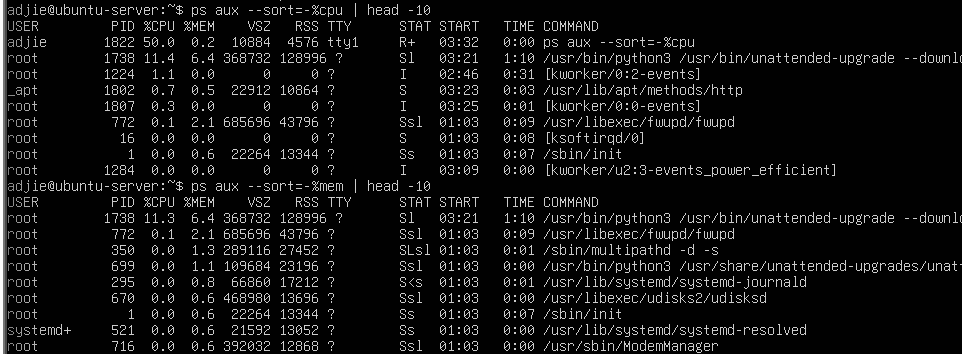
2. Eksplorasi top
```
top
# Tekan M, P, 1 , u secara bergantian
# Tekan q untuk keluar
```
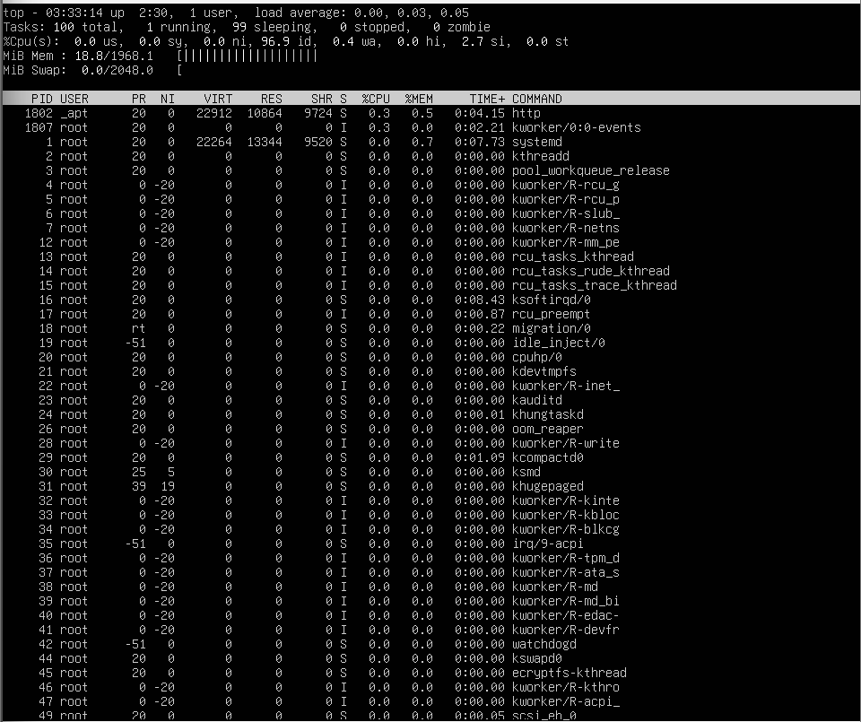
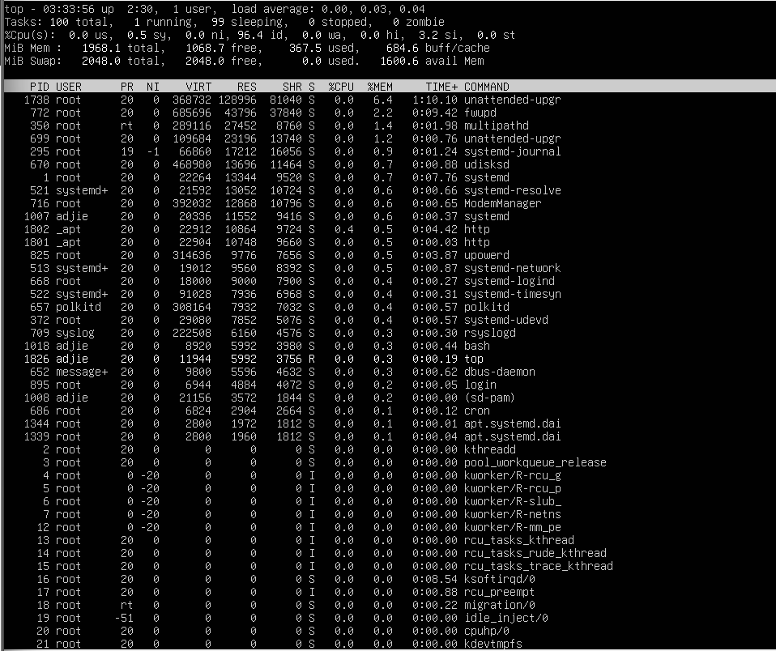
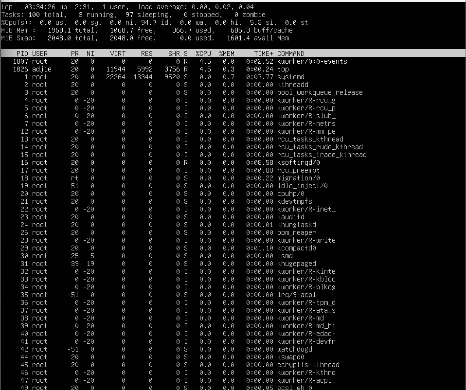
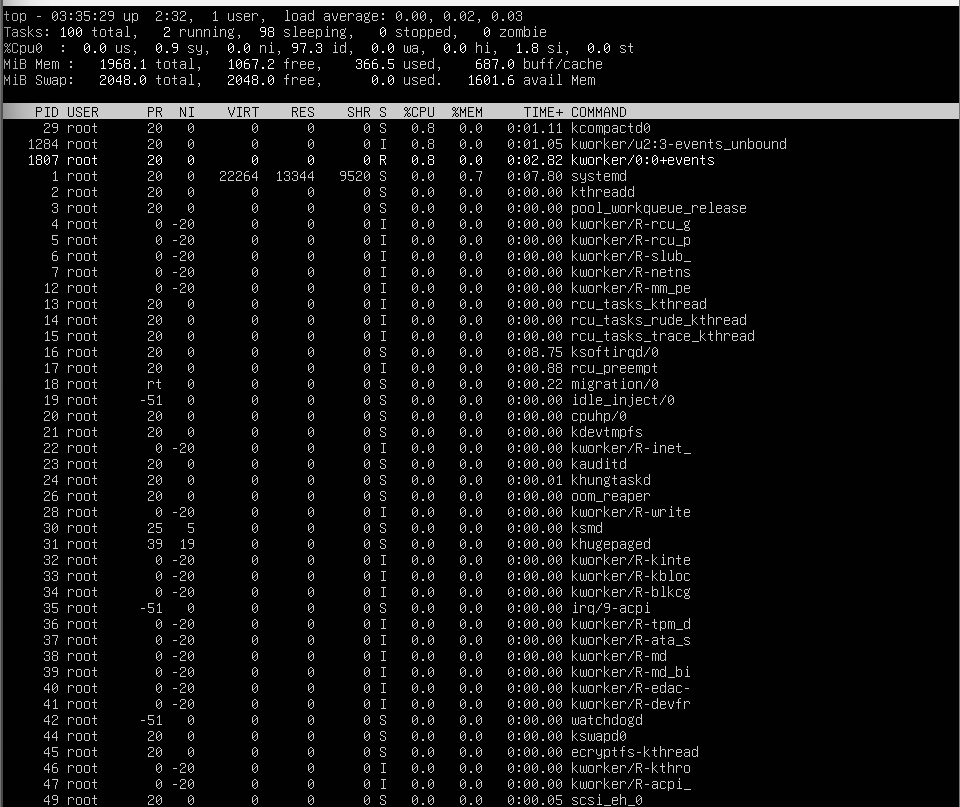
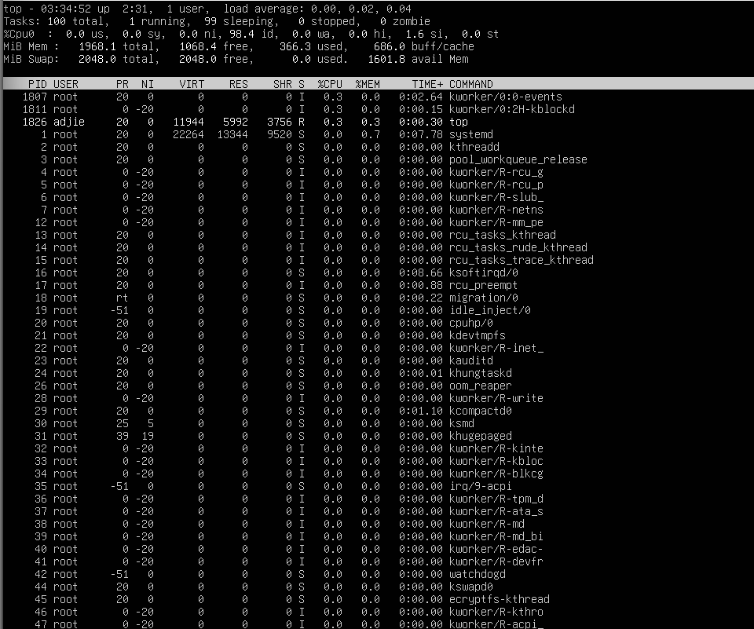
3. Menggunakan htop
```
kill %1 %2 %3
jobs
```
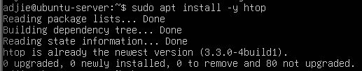
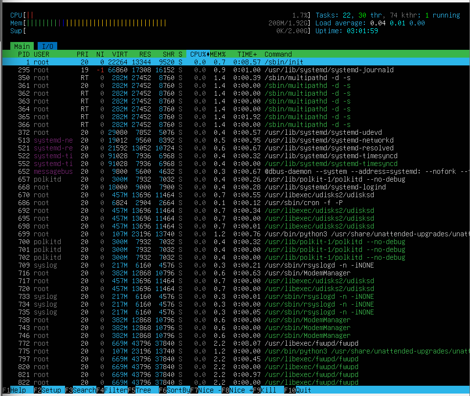
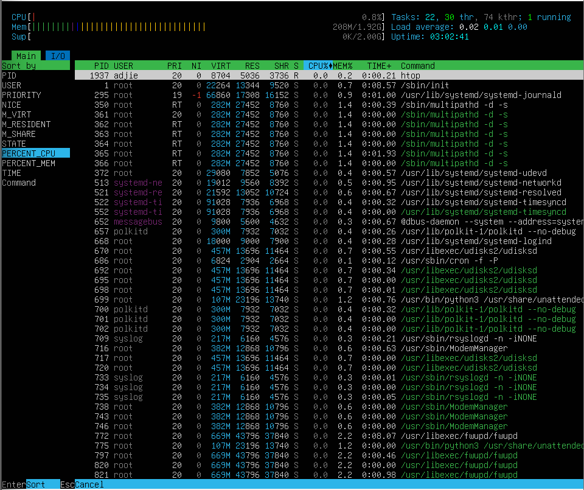

# Latihan 6.6
1. Gunakan ps aux –sort=%mem untuk menemukan proses yang menggunakan memori paling banyak di VM Anda. Proses apa itu?
Jawaban : 
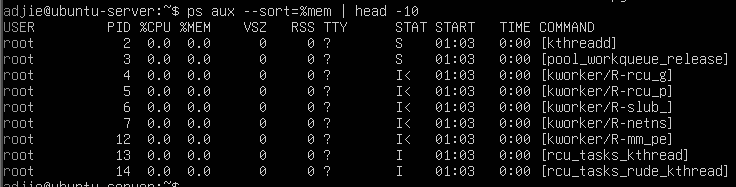

2. Di dalam top, tekan 1 . Apa yang berubah pada tampilan? Mengapa
informasi ini berguna?
Jawaban : 
ketika kkita menekan angka 1 di dalam kondisi top, header akan berubah dari yang awalnya menampilkan ringkasan penggunaan CPU secara keseluruhana, menjadi rincian penggunaan cpu setiap code CPU secara terpisah.

3. Di dalam htop, navigasikan ke proses sshd menggunakan tombol panah.
Tekan F9 dan amati opsi sinyal yang tersedia.
Jawaban : 
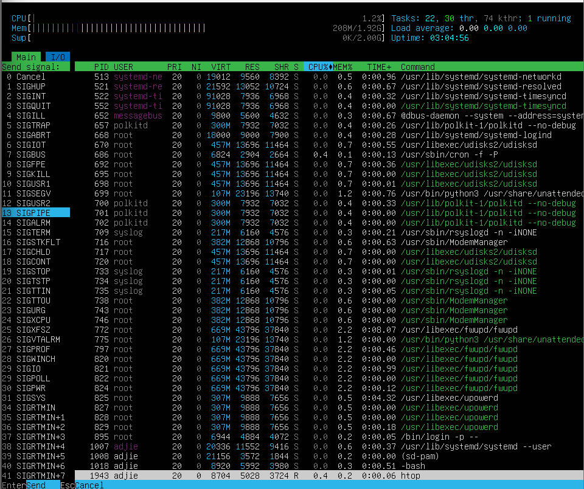


### 1.8 Latihan

## Latihan 6.A
# Eksplorasi Proses Sistem
1. Jalankan ps aux –forest dan temukan proses dengan PID 1. Apa
nama dan fungsi proses tersebut dalam sistem Linux modern?
Jawaban : 
proses yang di hasilkan PID 1 adlaah /sbin/init
proses ini berfungsi sebagai parent atau induk dari segala prosesnya
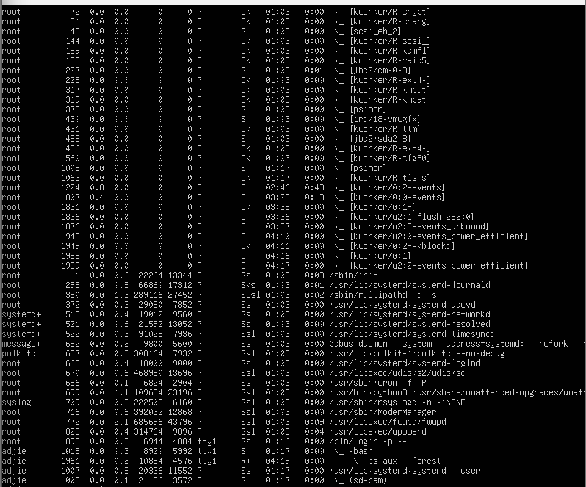
2. Hitung berapa proses yang dimiliki oleh user root dan berapa yang
dimiliki oleh user Anda. Mengapa root memiliki lebih banyak proses?
Jawaban : 
untuk proses ini bisa kita hitung manual, tetapi kondisi linux bisa di buat lebih cepat dengan mengetikkan 
ps -U <root> | wc -l
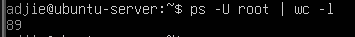

3. Temukan semua proses yang berada dalam kondisi S. Mengapa sebagian
besar proses di sistem berada dalam kondisi ini?
Jawaban : 
untuk proses ini bisa kita hitung manual, tetapi kondisi linux bisa di buat lebih cepat dengan mengetikkan 
ps -U <user> | wc -l
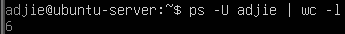

## Latihan 6.B
#Simulasi Manajemen Job
1. Jalankan tiga perintah sleep dengan durasi 100, 200, dan 300 detik di
background. Verifikasi ketiganya dengan jobs.
Jawaban : 
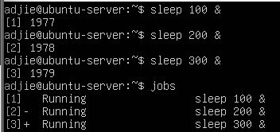
2. Bawa job kedua ke foreground, jeda dengan Ctrl+Z , lalu kembalikan
ke background dengan bg.
Jawaban : 
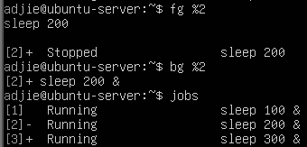

3. Hentikan job pertama dengan kill %1. Tampilkan kembali daftar job.
Berapa job yang tersisa?
Jawaban : 
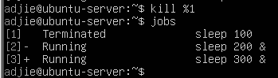

## Latihan 6.C
#Prioritas dan Sinyal
1. Jalankan dua proses sleep: satu dengan nice +5 dan satu dengan nice
+15. Verifikasi nilai NI keduanya dengan ps.
Jawaban : 
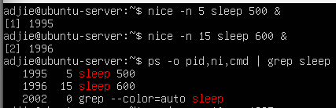

2. Gunakan renice untuk mengubah nice proses pertama menjadi +10.
Proses mana yang kini lebih diprioritaskan scheduler?
Jawaban : 
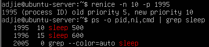

3. Kirim SIGSTOP ke salah satu proses, verifikasi kondisi T-nya, lalu kirim
SIGCONT. Akhiri semua proses percobaan dengan pkill sleep.
Jawaban : 

