# Laporan Praktikum Sistem Operasi Jobsheet 9

<h4> Nama   : Muhammad Unggul Satria Adjie <h4>
<h4> NIM    : 254107020040 <h4>
<h4> Kelas  : TI-1G <h4>

## Praktikum 7.1 Script Pertama: Laporan Sistem
1. Buat workspace praktikum:
```
mkdir -p ~/ praktikum - os / week09 /{ scripts , logs , data }
cd ~/ praktikum - os / week09 / scripts
```

Kode 1.4: Menyiapkan workspace
2. Buat script dengan nano:
```
nano laporan - sistem . sh
```

Kode 1.5: Membuka nano
3. Ketik isi berikut, simpan ( Ctrl+O Enter ), lalu keluar ( Ctrl+X ):
#!/ bin/ bash
### Script : laporan - sistem .sh
```
echo " ================================ "
echo " LAPORAN SISTEM "
echo " ================================ "
echo " Tanggal : $( date '+%A, %d %B %Y ')"
echo "Jam : $( date '+%H:%M:%S ')"
echo " Hostname : $( hostname )"
echo " User : $( whoami )"
echo "CPU core : $( nproc )"
echo "RAM bebas : $( free -h | awk '/^ Mem/ { print $4 }')"
echo " Disk / : $(df -h / | awk 'NR ==2 { print $5 }')
terpakai "
echo " ================================ "
```

Kode 1.6: Isi laporan-sistem.sh
4. Beri izin dan jalankan:
```
chmod + x laporan - sistem . sh
./ laporan - sistem . sh
```

Kode 1.7: Menjalankan script

### Latihan Latihan 9.1
Modifikasi laporan-sistem.sh agar menyimpan output ke file
laporan-YYYY-MM-DD.txt sekaligus menampilkannya di terminal. Petunjuk:
gunakan tee yang sudah dipelajari di bab sebelumnya.
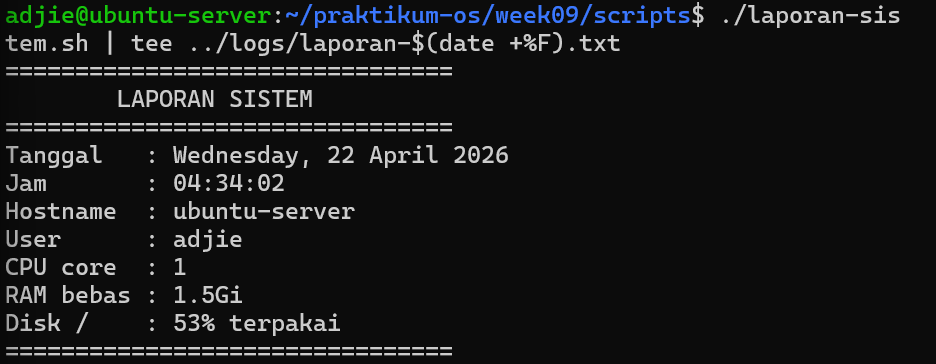

## Praktikum 7.2 Script Info Sistem dengan Argumen
1. Buat script:
```
nano ~/ praktikum - os / week09 / scripts / info - sistem . sh
```
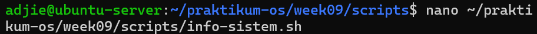
Kode 1.9: Membuat script info-sistem.sh
2. Ketik isi berikut:
#!/ bin/ bash
# Penggunaan : ./ info - sistem .sh [nama - admin ] [batas - disk - persen ]
```
ADMIN = $ {1: -" Tidak dikenal "}
BATAS = $ {2: -80}
TANGGAL = $ ( date '+%F %T')
DISK_PERSEN = $ ( df / | awk 'NR ==2 { print $5}' | tr -d '%
')
echo " Admin : $ADMIN "
echo " Tanggal : $TANGGAL "
echo " Disk / : ${ DISK_PERSEN }% terpakai "
echo " Batas : ${ BATAS }%"
if [ " $DISK_PERSEN " - gt " $BATAS " ]; then
echo " STATUS : PERINGATAN - disk melebihi batas !
"
else
SISA = $ (( BATAS - DISK_PERSEN ) )
echo " STATUS : Normal ( sisa toleransi ${ SISA }%)"
fi
```
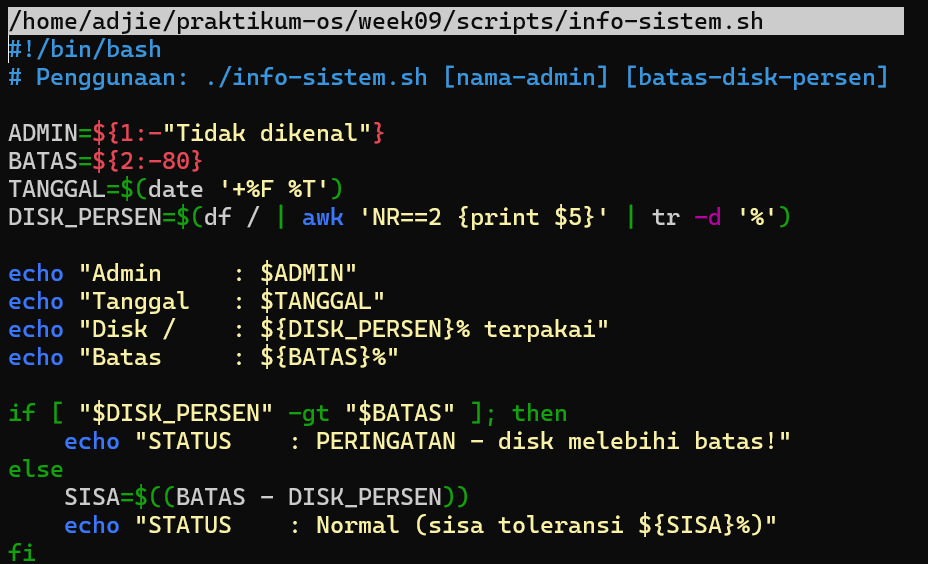
Kode 1.10: Isi info-sistem.sh
3. Simpan, beri izin, uji dengan berbagai kombinasi argumen:
```
chmod + x ~/ praktikum - os / week09 / scripts / info - sistem . sh
./ info - sistem . sh
./ info - sistem . sh " Dian " 50
./ info - sistem . sh " Dian " 10
```
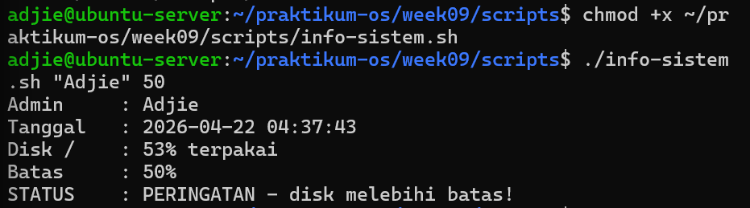
Kode 1.11: Menguji script
### Latihan Latihan 9.2
Buat script kalkulator.sh yang menerima tiga argumen: <angka1>
<operator> <angka2> dengan operator +, -, *, atau /. Contoh:
./kalkulator.sh 20 + 5 menghasilkan 25. Gunakan case untuk memilih
operasi, dan validasi jika argumen tidak lengkap.
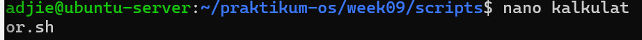
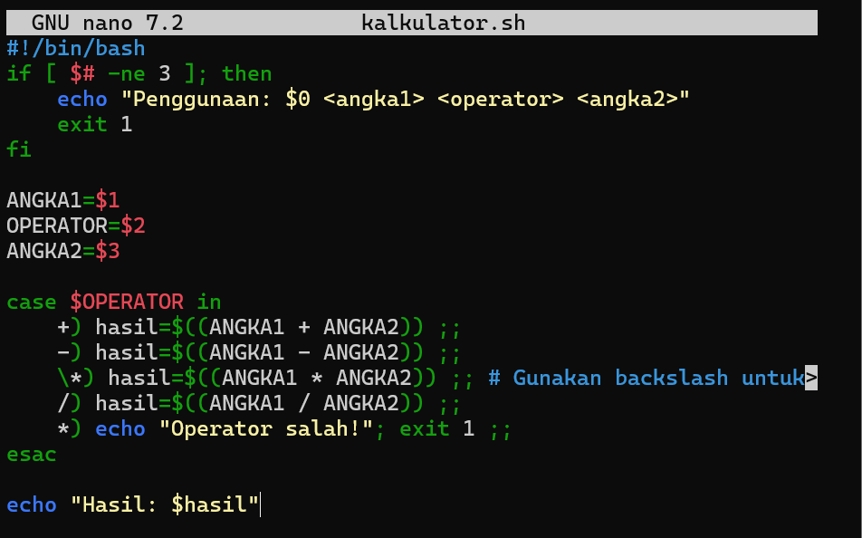

## Praktikum 7.3 Script Grading dan Menu Interaktif
1. Buat script grading (menggunakan if dan for):
```
nano ~/ praktikum - os / week09 / scripts / grading - batch . sh
```
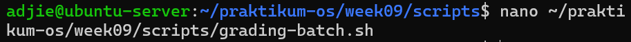
Kode 1.13: Membuat script grading-batch.sh
2. Ketik isi berikut:
#!/ bin/ bash
# Script : grading - batch .sh
# Proses daftar nilai mahasiswa
```
MAHASISWA =(" Andi :92" " Budi :73" " Citra :55" " Deni :80" "
Eka :45")
echo "=== HASIL GRADING ==="
for ENTRI in "${ MAHASISWA [@]}"; do
NAMA = $ ( echo " $ENTRI " | cut -d : - f1 )
NILAI = $ ( echo " $ENTRI " | cut -d : - f2 )
if [ " $NILAI " - ge 85 ]; then
GRADE ="A"
elif [ " $NILAI " - ge 75 ]; then
GRADE ="B"
elif [ " $NILAI " - ge 65 ]; then
GRADE ="C"
elif [ " $NILAI " - ge 55 ]; then
GRADE ="D"
else
GRADE ="E"
fi
printf "% -10s %3d %s\n" " $NAMA " " $NILAI " " $GRADE "
done
echo " ===================== "
```

3. Simpan, beri izin, dan jalankan:
```
chmod + x ~/ praktikum - os / week09 / scripts / grading - batch .
sh
./ grading - batch . sh
```
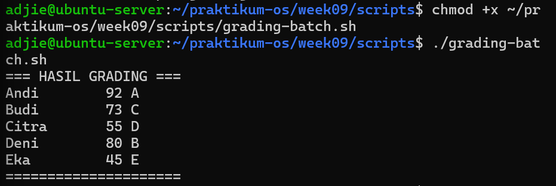
Kode 1.15: Menjalankan script grading
4. Buat script menu interaktif (while + case):
```
nano ~/ praktikum - os / week09 / scripts / menu - sistem . sh
```

Kode 1.16: Membuat script menu-sistem.sh
5. Ketik isi berikut:
#!/ bin/ bash
# Menu interaktif pemantauan sistem
```
while true ; do
echo ""
echo " ===== MENU MONITOR ===== "
echo "1) Info disk "
echo "2) Info memori "
echo "3) Proses teratas "
echo "4) Keluar "
echo -n " Pilih [1 -4]: "
read PILIHAN
case $PILIHAN in
1) df -h ;;
2) free -h ;;
3) ps aux -- sort = -% cpu | head -6 ;;
4) echo " Sampai jumpa !"; exit 0 ;;
*) echo " Pilihan tidak valid ." ;;
esac
done
```
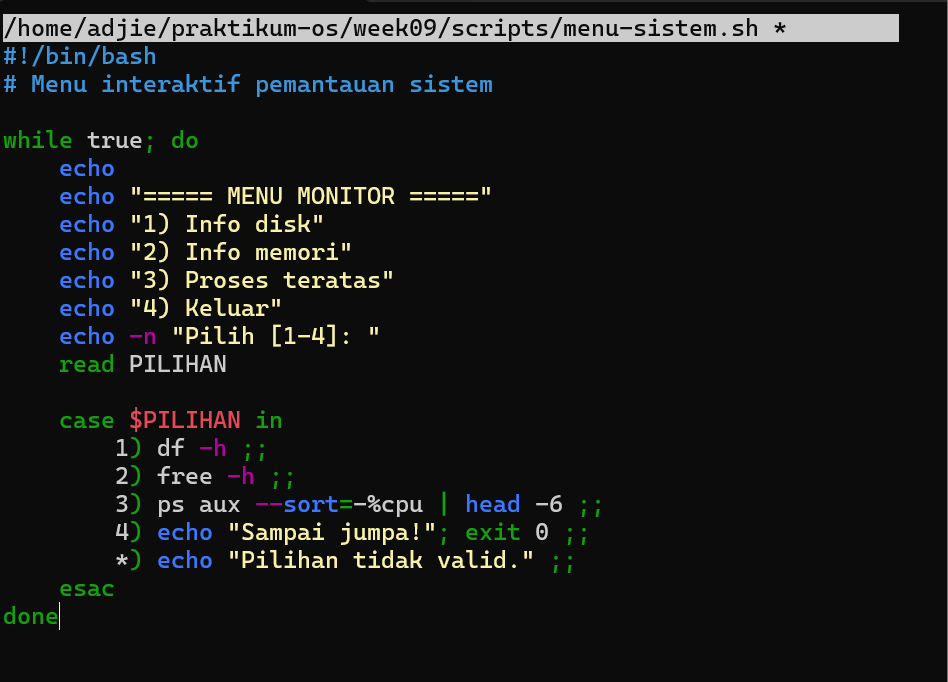
6. Beri izin dan jalankan, coba setiap opsi:
```
chmod + x ~/ praktikum - os / week09 / scripts / menu - sistem . sh
./ menu - sistem . sh
```
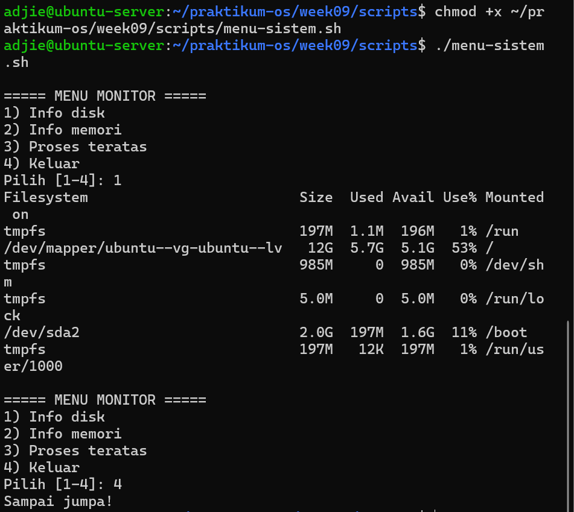
Kode 1.18: Menjalankan menu
### Latihan Latihan 9.3
Tambahkan ke script grading-batch.sh sebuah ringkasan di bagian bawah
yang menampilkan: jumlah mahasiswa per grade (A, B, C, D, E) menggunakan
perulangan for kedua yang mengiterasi array MAHASISWA.
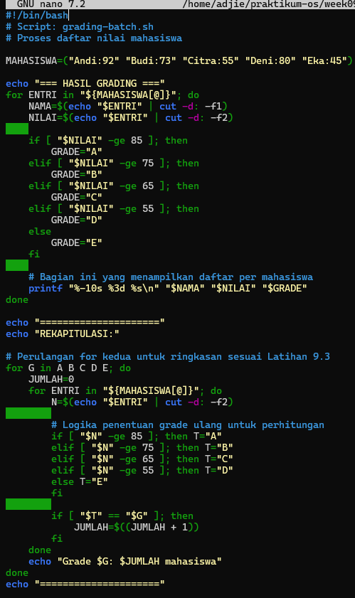

## Praktikum 7.4 Library Fungsi Validasi
1. Pemrograman Bash :
```
nano ~/ praktikum - os / week09 / scripts / lib - validasi . sh
```
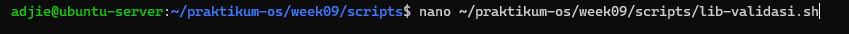
Kode 1.20: Membuat lib-validasi.sh
2. Ketik isi berikut:
#!/ bin/ bash
# lib - validasi .sh - Library fungsi validasi
```
adalah_angka () {
[[ "$1" =~ ^[0 -9]+ $ ]]
}
file_bisa_dibaca () {
[ -f "$1" ] && [ -r "$1" ]
}
error_exit () {
echo " ERROR : $1" >&2
exit 1
}
info () { echo "[ INFO ] $1"; }
sukses () { echo "[OK] $1"; }
```
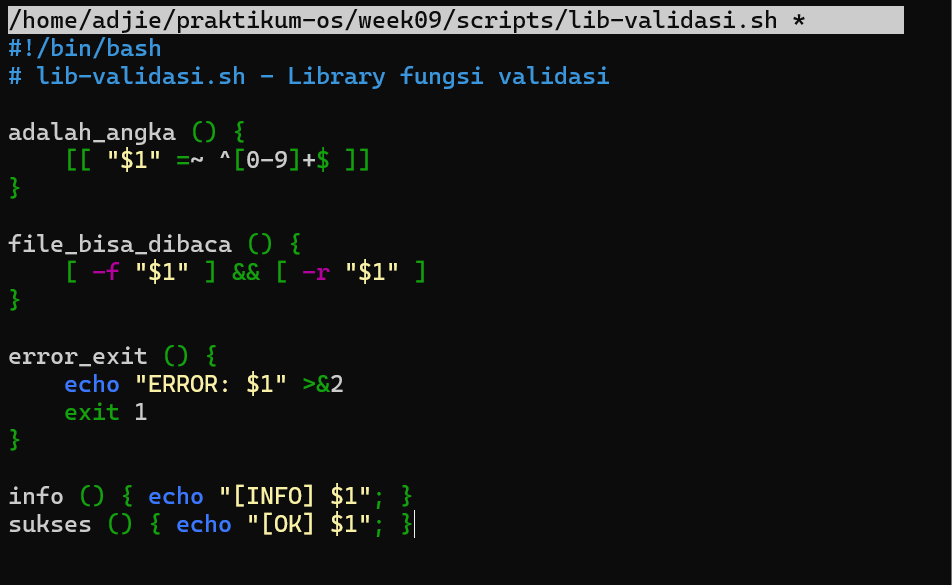
Kode 1.21: Isi lib-validasi.sh
3. Buat script yang menggunakan library:
```
nano ~/ praktikum - os / week09 / scripts / pakai - library . sh
```
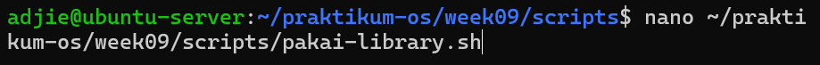
Kode 1.22: Membuat script pakai-library.sh
4. Ketik isi berikut:
#!/ bin/ bash
# Muat library ( seperti import di Java )
```
source ~/ praktikum - os / week09 / scripts / lib - validasi . sh
ANGKA = $1
FILE = $2
[ -z " $ANGKA " ] || [ -z " $FILE " ] && \
error_exit " Penggunaan : $0 <angka > <path -file >"
if adalah_angka " $ANGKA "; then
sukses " Input '$ANGKA ' adalah angka valid "
else
error_exit "'$ANGKA ' bukan angka "
fi
if file_bisa_dibaca " $FILE "; then
sukses " File '$FILE ' bisa dibaca "
info " Jumlah baris : $(wc -l < " $FILE ")"
else
error_exit " File '$FILE ' tidak ada atau tidak bisa
dibaca "
fi
```
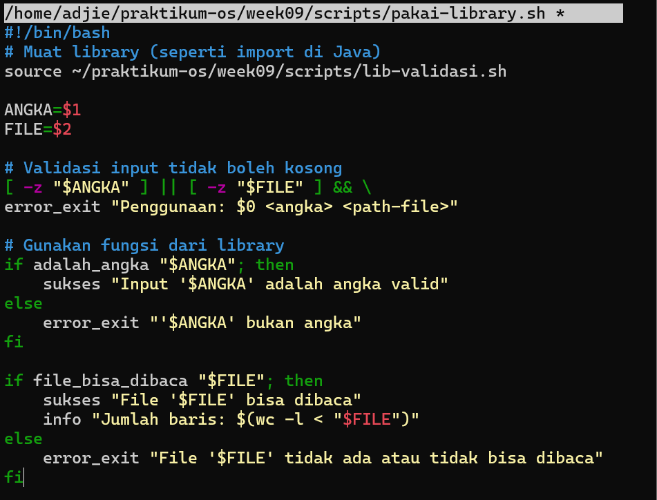
Kode 1.23: Isi pakai-library.sh
5. Beri izin dan uji semua skenario:
```
chmod + x ~/ praktikum - os / week09 / scripts / pakai - library .
sh
./ pakai - library . sh 42 / etc / hostname
./ pakai - library . sh abc / etc / hostname
./ pakai - library . sh 42 / tidak - ada . txt
./ pakai - library . sh
```
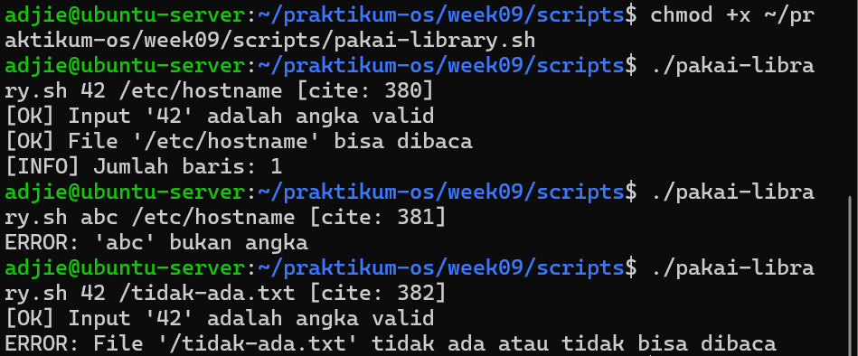
Kode 1.24: Menguji semua skenario
### Latihan Latihan 9.4
Tambahkan fungsi konfirmasi() ke lib-validasi.sh. Fungsi ini
menampilkan pertanyaan, membaca input Y/N dari user, mengembalikan
0 jika Y dan 1 jika N. Buat script demo yang memanggil fungsi ini sebelum
menghapus sebuah file.
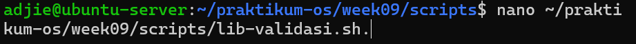
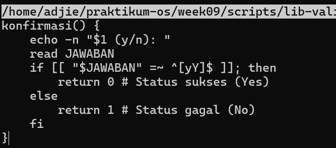
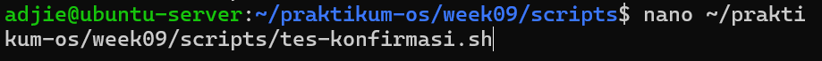
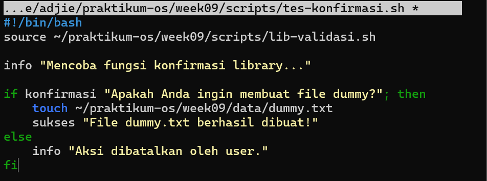
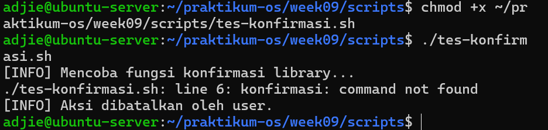

## Praktikum 7.5 Script Backup dengan Opsi
1. Buat script:
```
nano ~/ praktikum - os / week09 / scripts / backup - data . sh
Kode 1.26: Membuat backup-data.sh
```

2. Ketik isi berikut:
#!/ bin/ bash
# Penggunaan : ./ backup - data .sh [ -v] [ -c] [ -l logfile ]
<!-- <sumber > <tujuan > -->
VERBOSE = false
COMPRESS = false
LOG_FILE =""
while getopts "vcl:" OPSI ; do
case $OPSI in
v ) VERBOSE = true ;;
c ) COMPRESS = true ;;
l ) LOG_FILE =" $OPTARG " ;;
*) echo " Penggunaan : $0 [ -v] [ -c] [ -l logfile ]
<!-- <sumber > <tujuan >" -->
```
exit 1 ;;
esac
done
shift $ (( OPTIND - 1) )
SUMBER = $1
TUJUAN = $2
log () {
local MSG ="[$( date '+%T ')] $1"
echo " $MSG "
[ -n " $LOG_FILE " ] && echo " $MSG " >> " $LOG_FILE "
}
[ -z " $SUMBER " ] || [ -z " $TUJUAN " ] && {
echo " ERROR : sumber dan tujuan wajib diisi "; exit
1; }
[ ! -d " $SUMBER " ] && { log " ERROR : $SUMBER tidak ada "
; exit 2; }
mkdir -p " $TUJUAN "
TANGGAL = $ ( date '+%F -%H%M%S')
[ " $VERBOSE " = true ] && log " Sumber : $SUMBER | Tujuan
: $TUJUAN "
if [ " $COMPRESS " = true ]; then
ARSIP =" $TUJUAN /backup -$( basename " $SUMBER ")-
$TANGGAL .tar.gz"
tar - czf " $ARSIP " -C "$( dirname " $SUMBER ")" "$(
    basename " $SUMBER ")"
log " Arsip : $ARSIP ($(du -sh " $ARSIP " | cut -f1))"
else
cp -r " $SUMBER " " $TUJUAN /backup -$( basename "
$SUMBER ")-$TANGGAL "
log " Backup selesai ."
fi
```
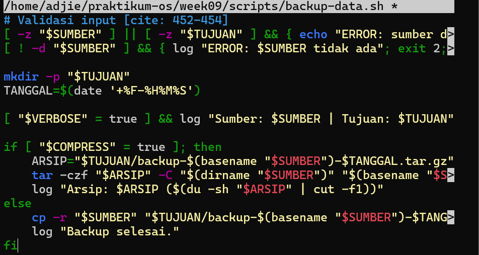
Kode 1.27: Isi backup-data.sh
3. Beri izin dan uji:
```
chmod + x ~/ praktikum - os / week09 / scripts / backup - data . sh
cd ~/ praktikum - os / week09 / scripts
# Tanpa opsi
./ backup - data . sh ~/ praktikum - os / week09 / data ~/
praktikum - os / week09 / logs
# Dengan verbose dan kompresi + log ke file
./ backup - data . sh -v -c -l ../ logs / backup . log \
~/ praktikum - os / week09 / data ~/ praktikum - os / week09 /
logs
cat ../ logs / backup . log
```
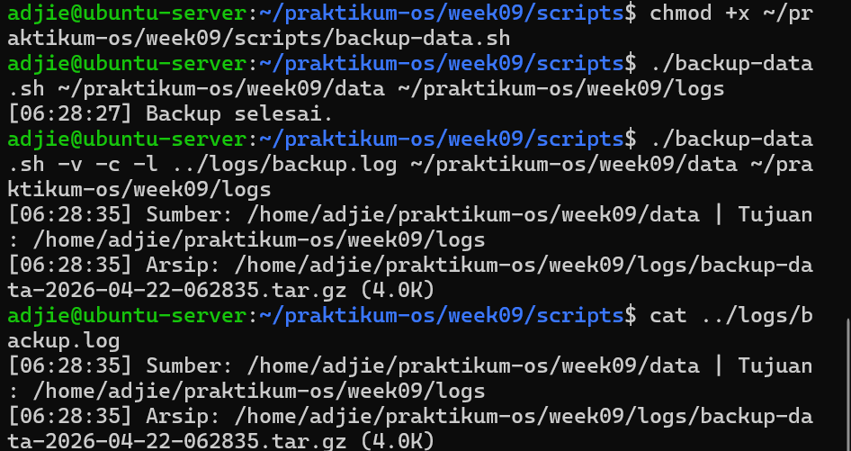
Kode 1.28: Menguji script backup

## Praktikum 7.6 Debugging Script
1. Buat script untuk dianalisis:
```
nano ~/ praktikum - os / week09 / scripts / debug - latihan . sh
```
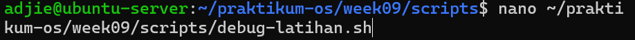
Kode 1.30: Membuat debug-latihan.sh
2. Ketik isi berikut:
#!/ bin/ bash
# Script : debug - latihan .sh
# Penggunaan : ./ debug - latihan .sh <direktori > <batas -MB>
```
DIREKTORI = $1
BATAS = $2
if [ $# -ne 2 ]; then
echo " Penggunaan : $0 <direktori > <batas -MB >"
exit 1
fi
UKURAN = $ ( du - sm " $DIREKTORI " | cut - f1 )
echo " Direktori : $DIREKTORI "
echo " Ukuran : ${ UKURAN } MB"
echo " Batas : ${ BATAS } MB"
if [ " $UKURAN " - gt " $BATAS " ]; then
echo " PERINGATAN : Ukuran melebihi batas !"
echo " Kelebihan : $(( UKURAN - BATAS )) MB"
else
echo " Status : Normal ( sisa : $(( BATAS - UKURAN )) MB
)"
fi
```
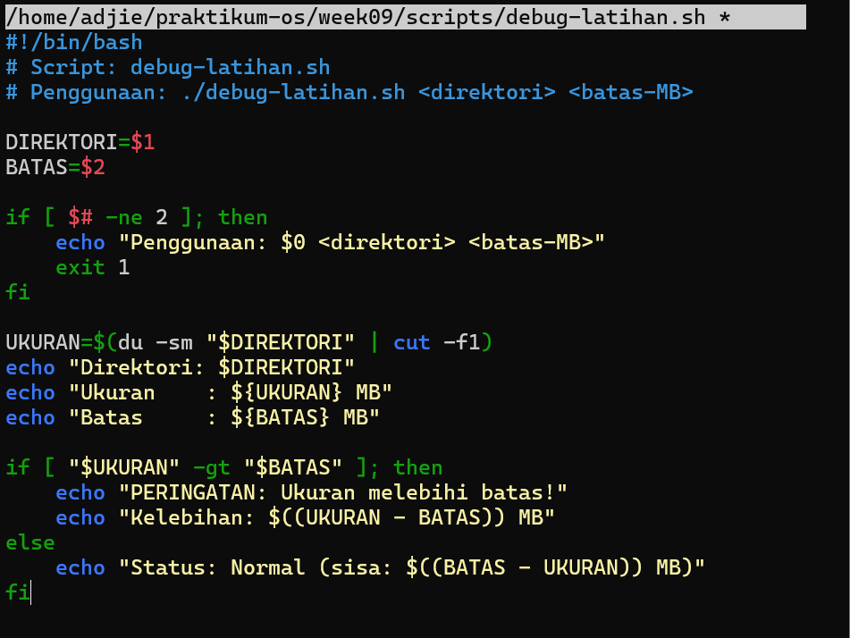
3. Cek sintaks, lalu jalankan dengan tracing:
```
chmod + x ~/ praktikum - os / week09 / scripts / debug - latihan .
sh
bash -n debug - latihan . sh && echo " Sintaks OK"
bash -x debug - latihan . sh / etc 10
./ debug - latihan . sh / var 50
./ debug - latihan . sh
```
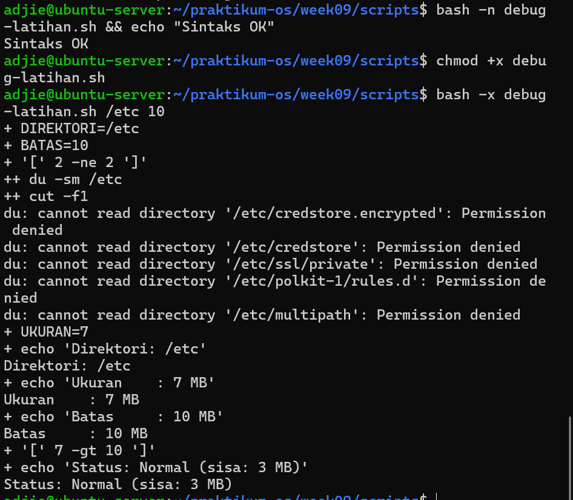
Kode 1.32: Menganalisis script dengan debugging
### Latihan Latihan 9.5
Script debug-latihan.sh tidak menangani direktori yang tidak ada. Perbaiki
dengan menambahkan:
• set -e di baris kedua
• Pengecekan -d "$DIREKTORI" sebelum memanggil du
• Pesan error yang informatif jika direktori tidak ditemukan
Uji dengan direktori yang tidak ada.
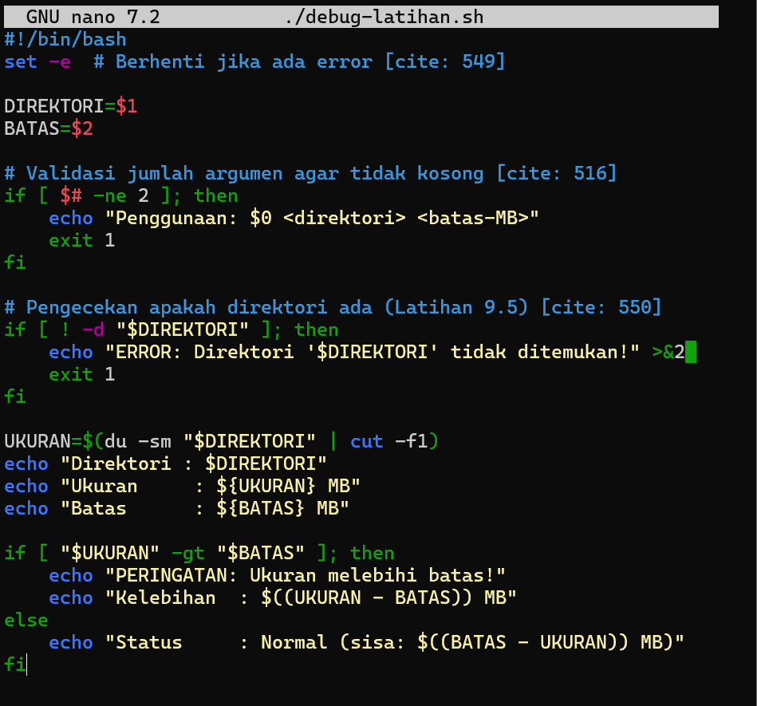
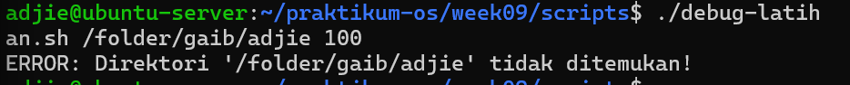


## 1.8 Tugas Praktikum

### Tugas 1 Script Absensi Kelas
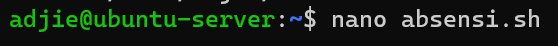
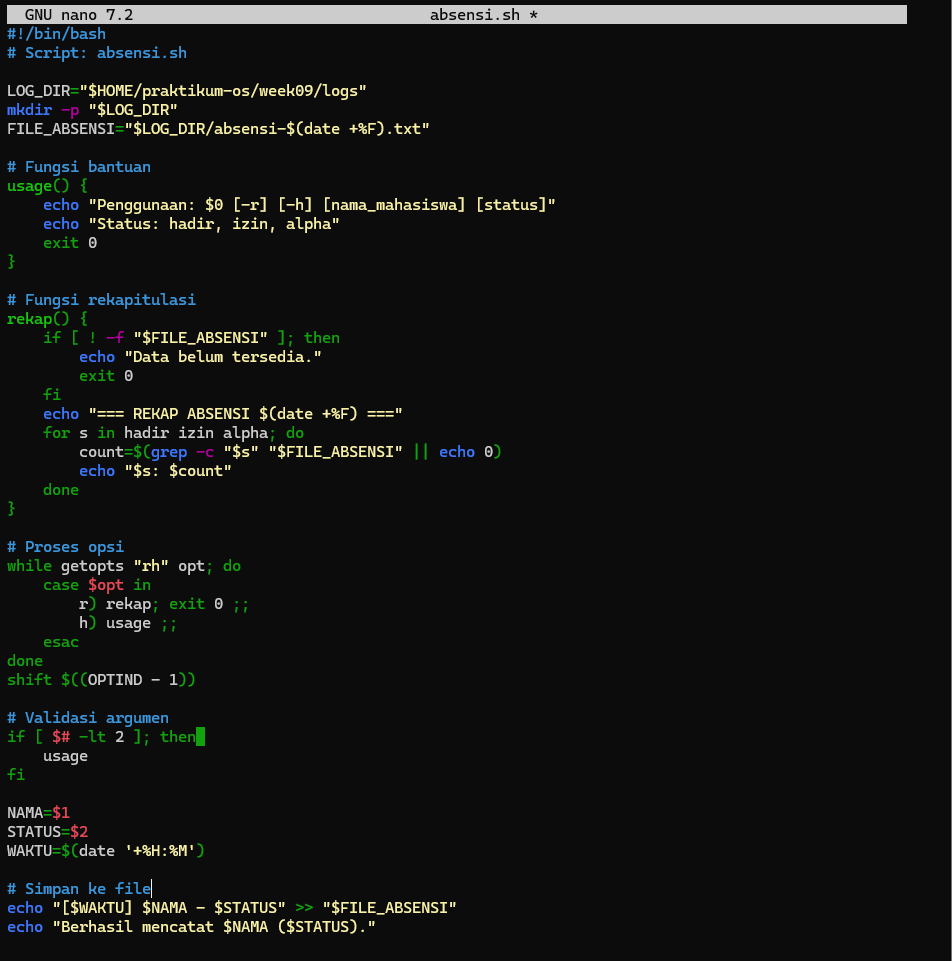
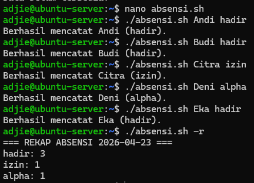

### Tugas 2 Script Health Check Sistem

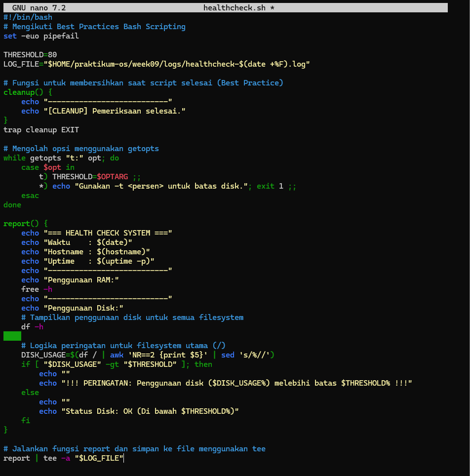
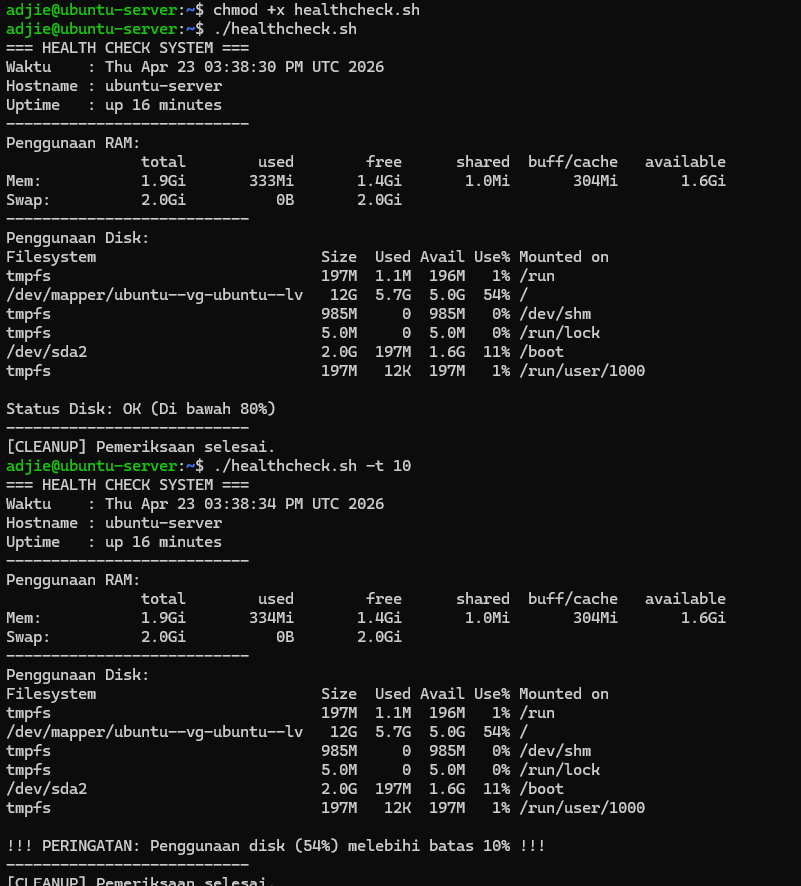