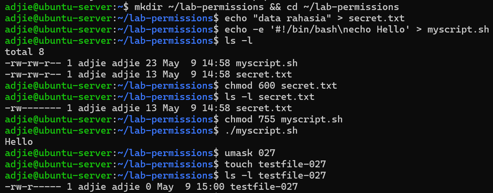
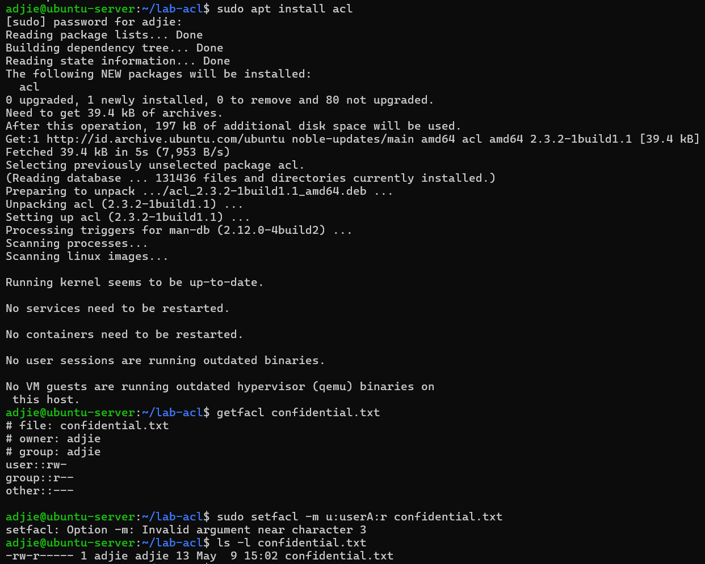
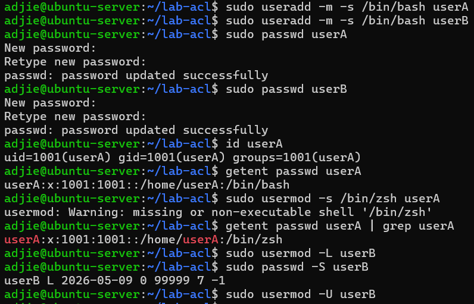
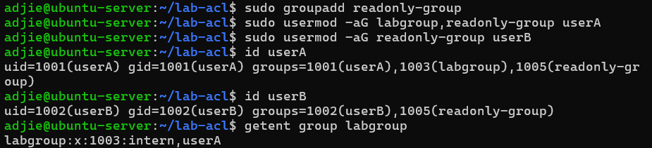
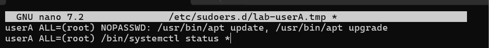
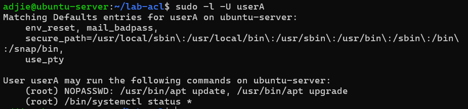
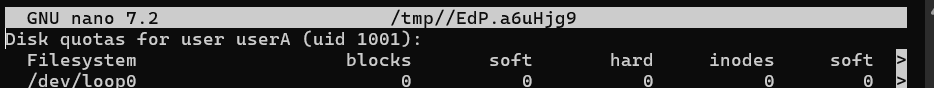
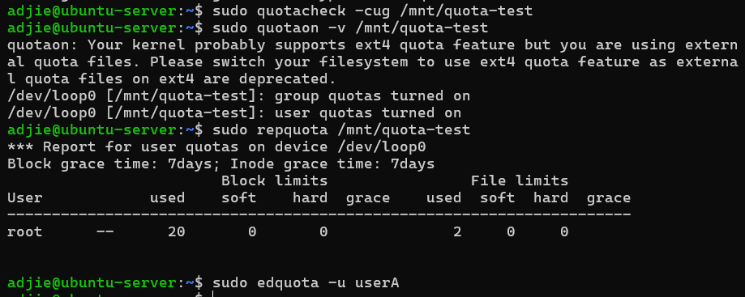

# Laporan Praktikum Sistem Operasi Jobsheet 11

<h4> Nama   : Muhammad Unggul Satria Adjie <h4>
<h4> NIM    : 254107020040 <h4>
<h4> Kelas  : TI-1G <h4>

## Praktikum 9.1 — Permissions
1. Langkah 1: Buat direktori kerja dan dua file uji.
```
mkdir ~/ lab - permissions && cd ~/ lab - permissions
echo " data rahasia " > secret . txt
echo '#!/ bin/ bash ' > myscript . sh
echo 'echo Hello ' >> myscript . sh
ls - la
```
2.  Langkah 2: Jadikan secret.txt privat hanya untuk owner.
```
chmod 600 secret . txt
ls -l secret . txt
```
3. Langkah 3: Jadikan myscript.sh dapat dijalankan.
```
chmod 755 myscript . sh
ls -l myscript . sh
./ myscript . sh
```
4. Langkah 4: Buat direktori bersama dan amati efek SGID sederhana.
```
mkdir shared - dir
chmod g + s shared - dir
ls - ld shared - dir
```
5. Langkah 5: Uji efek umask pada file baru.
```
umask
umask 027
touch testfile -027
ls -l testfile -027
```

### Analisis
1. Mengapa secret.txt tidak dapat dibaca oleh group dan others setelah chmod 600?
Jawaban : 
Karena perintah chmod 600 menghapus seluruh bit izin untuk yang lainnya. hanya owner yang memiliki bit rw-
2. Apa perbedaan arti 600 dan 755 terhadap file yang diuji?
Jawaban : 
- 600: Izin privat. Hanya owner yang bisa baca/tulis. Cocok untuk data sensitif.
- 755: Izin publik/executable. Owner punya akses penuh, sementara yang lain bisa membaca dan mengeksekusi program tersebut. 
3. Setelah umask 027, permission apa yang dihasilkan untuk file baru, dan mengapa bukan 777?
- Menghasilkan permission 640 untuk file baru (rw-r-----). Nilainya bukan 777 karena umask bertindak sebagai pengurang izin default; ia mematikan izin tulis untuk group dan seluruh akses untuk others.
### Tantangan
Ubah owner atau group salah satu file uji ke akun atau group lain yang tersedia di sistem, kemudian jelaskan
perubahan output ls -l sebelum dan sesudahnya.


## Praktikum 9.2 — ACL
1. Langkah 1: Siapkan file dan lihat permission standar tanpa ACL tambahan
```
mkdir ~/ lab - acl && cd ~/ lab - acl
echo " Data penting " > confidential . txt
chmod 640 confidential . txt
ls -l confidential . txt
getfacl confidential . txt
```
2. Langkah 2: Beri akses baca ke satu user tertentu tanpa mengubah owner atau group.
```
setfacl -m u : userA : r confidential . txt
ls -l confidential . txt
getfacl confidential . txt
```
3. Langkah 3: Buat direktori bersama yang mewariskan ACL ke file baru.
```
mkdir shared
setfacl -d -m u : userA : rwx shared
setfacl -d -m u : userB :r - x shared
getfacl shared
touch shared / inherited . txt
getfacl shared / inherited . txt
```


### Analisis
1. Mengapa getfacl confidential.txt awalnya tidak menampilkan user tertentu?
Jawaban : 
- Karena file tersebut hanya menggunakan model permission Unix standar. ACL tambahan baru muncul setelah kita menggunakan perintah setfacl.
2. Setelah setfacl -m u:userA:r confidential.txt, apa perbedaan output ls -l dan getfacl?
Jawban : 
- Output ls -l akan menampilkan tanda + di akhir string permission (contoh: -rw-r--+) yang menandakan adanya ACL. getfacl akan menampilkan rincian siapa saja user/group tambahan yang diberi akses.
3. Mengapa file inherited.txt mewarisi ACL dari direktori shared?
Jawaban : 
- Setiap file baru yang dibuat di dalam direktori dengan Default ACL akan otomatis mewarisi aturan akses tersebut.
### Tantangan
Tambahkan satu ACL lagi agar group readonly-group hanya dapat membaca confidential.txt. Setelah
itu, hapus ACL untuk userA dan verifikasi hasil akhirnya dengan getfacl.


## Praktikum 9.3A — Membuat dan Mengelola User
1. Tujuan: membuat user baru, memodifikasi propertinya, dan memahami perbedaan opsi useradd dan usermod.
```
# buat dua user
sudo useradd -m -s / bin / bash userA
sudo useradd -m -s / bin / bash userB
sudo passwd userA
sudo passwd userB
# verifikasi
id userA
getent passwd userA
# modifikasi shell userA
sudo usermod -s / bin / zsh userA
getent passwd userA
# lock dan unlock userB
sudo usermod -L userB
sudo passwd -S userB
sudo usermod -U userB
sudo passwd -S userB
```

### Pertanyaan:
1. Apa perbedaan output id userA sebelum dan sesudah menambah group?
Jawaban : 
- id user A ini nanti akan menampilkan UID, GID, dan daftar seluruh group tamhahan yang diikui oleh user.
2. Bagaimana status passwd -S userB berubah saat akun di-lock?
Jawaban : 
- Output passwd -S akan menunjukkan simbol L atau ! di awal baris, yang menandakan akun tersebut tidak bisa digunakan untuk login.

## Praktikum 9.3B — Group Management
1. Tujuan: membuat group, menambahkan user ke group, dan memverifikasi keanggotaan
```
# buat dua group
sudo groupadd labgroup
sudo groupadd readonly - group
# tambahkan userA ke kedua group
sudo usermod - aG labgroup , readonly - group userA
# tambahkan userB hanya ke readonly - group
sudo usermod - aG readonly - group userB
# verifikasi
id userA
id userB
getent group labgroup
getent group readonly - group
```

### Pertanyaan:
1. Apa yang ditampilkan id userA vs groups userA?
Jawaban : 
- 
2. Mengapa -a pada usermod -aG penting?
Jawaban : 
- Sangat penting agar group baru ditambahkan tanpa menghapus keanggoataan user di group" lama


## Praktikum 9.3C — Password Aging Policy
1. Tujuan: menerapkan kebijakan umur password dan mengamati efeknya.
```
# set aging policy untuk userA
sudo chage -M 60 -W 7 -m 1 userA
sudo chage -l userA
# paksa userA ganti password saat login pertama
sudo chage -d 0 userA
# kunci password userB
sudo passwd -l userB
sudo passwd -S userB
# unlock kembali
sudo passwd -u userB
sudo passwd -S userB
```

### Pertanyaan:
1. Apa arti nilai yang ditampilkan chage -l userA?
Jawaban : 
- Menampilkan informasi detail masa berlaku password, termasuk kapan terakhir diganti dan kapan akun akan kadaluwarsa
2. Bagaimana cara membuktikan userB terkunci dari output passwd -S?
Jawaban : 
- 
3. Kapan sebaiknya menggunakan chage -d 0 vs passwd -e?
Jawaban : 
- Keduangan memaksa user mengganti password saat login pertama kali. Namun, chage lebih fleksibel untuk pengaturan kebijakan otomatis
### Tantangan
Buat user bernama intern yang:
• memiliki shell /bin/bash;
• menjadi anggota labgroup;
• dipaksa ganti password pada login pertama;
• password expired setelah 45 hari dengan warning 7 hari sebelumnya.


## Praktikum 9.4 — Konfigurasi sudo
1. Langkah 1: Buat file konfigurasi sudo khusus untuk userA.
```
sudo visudo -f / etc / sudoers . d / lab - userA
userA ALL =( root ) NOPASSWD : / usr / bin / apt update , / usr / bin / apt
upgrade
userA ALL =( root ) / bin / systemctl status *
```
2. Langkah 2: Verifikasi aturan yang aktif dan uji hasilnya.
```
sudo -l -U userA
sudo grep " userA " / var / log / auth . log | tail -10
```


### Analisis
1. Mengapa aturan disimpan di /etc/sudoers.d//, bukan langsung di /etc/sudoers?
Jawaban : 
- Agar konfigurasi tetap rapi dan tidak merusak file utama /etc/sudoers saat ada update sistem
2. Mana perintah yang bisa dijalankan tanpa password, dan mana yang masih perlu autentikasi?
Jawaban : 
- Perintah apt update dan upgrade bisa dijalankan tanpa password, sementara perintah systemctl status tetap meminta pasword userA
3. Informasi apa saja yang dicatat di log sudo?
Jawaban : 
- Nebcata siapa yang menjalankan perintah, kapan, dimana, dan perintah apa yang dieksekusi.
### Tantangan
Tambahkan satu aturan baru agar userA boleh menjalankan /bin/systemctl restart ssh tetapi tidak boleh
menjalankan reboot.


## Praktikum 9.5 — Disk Quota
1. Langkah 1: Buat image filesystem kecil dan mount dengan opsi quota.
```
sudo dd if =/ dev / zero of =/ tmp / quota - test . img bs =1 M count =100
sudo mkfs . ext4 / tmp / quota - test . img
sudo mkdir -p / mnt / quota - test
sudo mount -o loop , usrquota , grpquota / tmp / quota - test . img / mnt /
quota - test
```
2. Langkah 2: Buat database quota dan aktifkan enforcement.
```
sudo quotacheck - cug / mnt / quota - test
sudo quotaon -v / mnt / quota - test
sudo repquota / mnt / quota - test
```
3. Langkah 3: Tetapkan quota untuk user uji dan amati hasilnya.
```
sudo edquota -u userA
# contoh : soft block 5120 , hard block 10240
sudo repquota / mnt / quota - test
```
4. Langkah 4: Bersihkan lingkungan uji setelah selesai.
```
sudo quotaoff / mnt / quota - test
sudo umount / mnt / quota - test
sudo rm / tmp / quota - test . img
```



### Analisis
1. Apa perbedaan soft limit dan hard limit saat quota mulai terlampaui?
Jawaban : 
- Soft limit adalah batas peringatan yang boleh dilampaui sementara selama grace period. Hard limit adalah batas mutlak yang tidak boleh dilampaui sama sekali.
2. Mengapa praktikum ini memakai loopback filesystem, bukan langsung /home/?
Jawaban : 
- Digunakan agar praktikum aman dan tidak mengganggu partisi sistem utama seperti /home.
3. Dari output repquota, informasi apa yang menunjukkan quota sudah aktif?
Jawaban : 
- Output repquota akan menampilkan baris statistik pemakaian userA dan limit yang sudah kita tetapkan.
### Tantangan
Coba atur quota baru untuk userA dengan batas inode yang sangat kecil, kemudian jelaskan kapan pembatasan
inode lebih penting daripada pembatasan block.


## 1.7 Latihan
### Latihan Latihan 9.A — Audit dan Kolaborasi


### Latihan Latihan 9.B — Kebijakan Akun dan Quota
